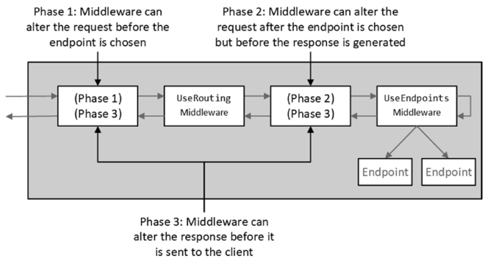

Chapter 12-Understanding the ASP.NET Core Platform
==============================

## Understanding the ASP.NET Core Request Flow

#### What is the purpose of Program.cs
```C#
public class Program {
   public static void Main(string[] args) {   // run firstly
      CreateHostBuilder(args).Build().Run();
   }

   public static IHostBuilder CreateHostBuilder(string[] args) =>
       Host.CreateDefaultBuilder(args)
           .ConfigureWebHostDefaults(webBuilder => {
              webBuilder.UseStartup<Startup>();
           });
}
```
An ***host*** is an object that encapsulates an app's resources, such as:
<ul>
  <li>Dependency injection (DI)</li>
  <li>Logging</li>
  <li>Configuration</li>
  <li>IHostedService implementations</li>
</ul> 

if you look at the source code of `CreateDefaultBuilder`, you will see how appsetting.json values read and represented as `IConfiguration`,  a `ServiceCollection` is created and some runtime required services are registered in this service collection (for example, `IConfiguration` is registered as Singleton in this service collection that's why we can inject `IConfiguration` whenever we want) and this service collection will be further passed to the startup's `ConfigureServices` method.

#### What is the purpose of Startup.cs

The ASP.NET Core platform creates three objects when it receives an HTTP request: 

1. A `HttpRequest` object that describe the request
2. A `HttpResponse` object that describes the response that will be returned to the client
3. A `HttpContext` object that provides access to ASP.NET Core feature.




```C#
public class Startup { 
   public void ConfigureServices(IServiceCollection services) {   // run secondly
      services.AddRazorPages();
      services.AddControllersWithViews();
   }

   public void Configure(IApplicationBuilder app, IWebHostEnvironment env) {    // run lastly   
      if (env.IsDevelopment()) {
         app.UseDeveloperExceptionPage();
      }

      // add a middleware delegate defined in-line to the application's request pipeline.
      app.Use(async (context, next) => {   // next is Func<Task>
         if (context.Request.Method == HttpMethods.Get && context.Request.Query["custom"] == "true") {
            await context.Response.WriteAsync("Custom Middleware \n");
         }
        await next();   // compiler will do `next(context);` for you
      });

      app.UseRouting();                 // use EndpointRoutingMiddleware middleware internally (UseRouting is just an extension method)
      app.UseEndpoints(endpoints => {   // use EndpointMiddleware middleware internally (UseEndpoints is just an extension method)
         endpoints.MapGet("/", async context => {   
            await context.Response.WriteAsync("Hello World!");
         });
         endpoints.MapGet("/secret", SecretEndpoint.Endpoint);
      });
   }
}

public class SecretEndpoint {
   public static async Task Endpoint(HttpContext context) {
      await context.Response.WriteAsync("This is the secret message");
   }
}
```
`UseRouting`: Matches request to an endpoint (in runtime when a request comes in).

`UseEndpoints`: Register endpoints (when application starts, before the first request comes in) and execute the matched endpoint (in runtime when a request comes in).

So the process is: when the application starts, `UseRouting` is called to tell asp.net core that when a request comes in, you need to modify something in `HttpContext` according to the registration setup by `UseEndpoints`. Let's say the first request is called requestA, when requestA reach the request pipeline, `EndpointRoutingMiddleware` is used to change requestA's context according to its url, so when requestA reaches to `EndpointMiddleware`, `EndpointMiddleware` can execute the associated endpoint. The details process will be covered in the next chapter.

Uses two middlewares in routing decouples the route matching and resolution functionality from the endpoint executing functionality, which allows those middlewares to utilize the information from endpoint routing, for example, the call to UseAuthentication must go after UseRouting, so that route information is available for authentication decisions and before UseEndpoints so that users are authenticated before accessing the endpoints.

So in a nutshell, `Configure` mehtod is run once when the application starts, `UseRouting` tells the request pipeline that when a request comes in, please match its url with an endpoint and `UseEndpoints`. Then `UseEndpoints` register endpoints. Note that `configure` action delegate will be run in `UseEndpoints`, so this delegate actually registers endpoints, then its `EndpointMiddleware` is used to execute the matching endpoint.

```C#
app.UseRouting();

app.UseEndpoints(endpoints => {   // use EndpointMiddleware middleware internally (UseEndpoints is just an extension method)
   // put a debugger here; debuggerOne, run once during setup
   endpoints.MapGet("/", async context => {   
      // put a debugger here; debuggerTwo; run everytime for a new request
      await context.Response.WriteAsync("Hello World!");
   });
   endpoints.MapGet("/secret", SecretEndpoint.Endpoint);
});
```
if you run the application by debugging, you will see the debuggerOne only breaks once (that's how `endpoints.MapGet` executes onece to register endpoints), but debuggerTwo runs every time for a new request, which is executed by EndpointMiddleware middleware, you get the idea when you look at the source code.

The reason of why the word `Endpoint` is chosen is because `End` means it is the last point that the request can go, for example, if you do:

```C#
app.UseRouting();

app.Use(async (context, next) => {
   await context.Response.WriteAsync("Starting \n");
   await next();
});

app.UseEndpoints(endpoints => {   
   endpoints.MapGet("/", async context => {   
      await context.Response.WriteAsync("Hello World!");
   });
   endpoints.MapGet("/secret", SecretEndpoint.Endpoint);
   ...
});

// the middlewares registered after UseEndpoints will be ignored

app.Use(async (context, next) => {
   await context.Response.WriteAsync("Ending \n");
   await next();
});

/*the output will be 
   Starting
   Hello World!
*/
```
The routing middleware short-circuits the pipeline when a route matches a URL so that the response is generated only by the route's endpoint. The request isn't forwarded to other endpoints or middleware components that appear later in the request pipeline.

But what happen if none of endpoints matches the url? In this case, since none of endpoints is used, the request pipeline is not considered as "end", let's look at a concrete example:
```C#
public void Configure(IApplicationBuilder app, IWebHostEnvironment env) {

   app.Use(async (context, next) => {
      await context.Response.WriteAsync("Hello World \n");
      await next();
   });

   app.UseRouting();

   app.UseEndpoints(endpoints => {
      endpoints.MapGet("/branch", async context => {
         await context.Response.WriteAsync("Branch Middleware \n");
      });

   });

   app.Use(async (context, next) => {
      await context.Response.WriteAsync("Last One \n");
      await next();
   });

   /* output will be
      When "/branch" is matched:

      Hello World
      Branch Middleware
      --------------------------
      When "/" is matched:

      Hello World
      Last One
   */
}
```

## Creating Custom Middleware

```C#
public delegate Task RequestDelegate(HttpContext context);

public class QueryStringMiddleWare {
   private RequestDelegate next;

   public Middleware(RequestDelegate nextDelegate) {
      next = nextDelegate;
   }

   public async Task Invoke(HttpContext context) {
      if (context.Request.Method == HttpMethods.Get && context.Request.Query["custom"] == "true") {
         await context.Response.WriteAsync("Class-based Middleware \n");
      }
      await next(context);   // or don't call next to short circuited the request pipeline
   }
}

public class Startup {
   ...
   public void Configure(IApplicationBuilder app, IWebHostEnvironment env) {
      ...
      app.UseMiddleware<QueryStringMiddleWare>();
      ...
   }
}
```
Note that if you don't call `await next(context);`, the request pipeline will be short-circuited.

## Create Pipeline Branches

The `Map` method is used to create a section of pipeline that is used to process requests for specific URLs, creating a separate sequence of middlewares:

```C#
public void Configure(IApplicationBuilder app, IWebHostEnvironment env) {
  
   app.UseMiddleware<WriteHelloMiddleWare>();

   app.Map("/branch", app => {
      app.Use(async (context, next) => {
         await context.Response.WriteAsync($"Branch Middleware");
         await next();
      });

      app.Use(async (context, next) => {
         await context.Response.WriteAsync($"\n Something more from Branch Middleware");  
         next();
      });
   });   // Map will only use the middlewares inside the method, it doesn't add the middleware (For all middlewares) after the method
         // if you want to include the middlewares below the method, you need to use "if then" to analyse HttpContext
         // to see why this behaviour occurs, see the extra materials "Why Map() Doesn't Add 'outer' Middleware 

   app.Use(async (context, next) => {   // this middleware will not be invoked if /branch is matched
      await context.Response.WriteAsync("For all middlewares \n");
   });
}

/* the output will be 
   When url match "/branch":

   Hello World
   Branch Middleware
   Something more from Branch Middleware
   -------------------------------------
   When url DO NOT match "/branch":
   
   Hello World
   For all middlewares
*/
```
You don't need to call `next()` in the last middleware in the `Map` method:
```C#
public void Configure(IApplicationBuilder app, IWebHostEnvironment env) {
   ...
   app.Map("/branch", app => {
      app.Use(async (context, next) => {
         await context.Response.WriteAsync($"...");
         await next();
      });

      app.Use(async (context, next) => {
         await context.Response.WriteAsync($"\n Something more from Branch Middleware");  
         next();
      });

      app.Use(async (context, next) => {
         await context.Response.WriteAsync($"\n Last");\
         // no need to call next(); since the request pipeline ends here too
      });
   });

   app.Use(async (context, next) => {
      await context.Response.WriteAsync("For all middlewares \n");
   });
}
```
ASP.NET Core also supports the `MapWhen` method, which can be used to match requests using a predicate, allowing requests to be selected for a pipeline branch on criteria other than just URLs:
```C#
// public static IApplicationBuilder MapWhen(this IApplicationBuilder app, Func<HttpContext, bool> predicate, Action<IApplicationBuilder> configuration);
app.MapWhen(context => context.Request.Query.Keys.Contains("branch"), app => { app.Use(...) });
```

## Creating Terminal Middleware

There are two versions of terminal middleware:
```C#
// Version One:
branch.Use(async (context, next) => {
   await context.Response.WriteAsync($"Last Middleware");
});

// Version Two:
branch.Run(async (context) => {   // since you don't call next() in terminal middleware, so you uses another signature of method that doesn't receive next
   await context.Response.WriteAsync($"Last Middleware");
});

public static class RunExtensions {
   // add a terminal middleware delegate to the application's request pipeline.
   public static void Run(this IApplicationBuilder app, RequestDelegate handler);
}
```
Note that Version Two uses `Run` method, not `Use` method, code below won't compile:
```C#
// code doesn't compile, you can only uses Run method to receive one argument in the delegate
branch.Use(async (context) => {
   await context.Response.WriteAsync($"Last Middleware");
});
```

Class-based components can be written so they can be used as both regular (non-terminal) and terminal middleware:
```C#
public class QueryStringMiddleWare {   // can be used as terminal or non-terminal middleware
   private RequestDelegate next;
   
   public QueryStringMiddleWare() {   // this constructor is for terminal middleware purpose
      // do nothing
   }

   public QueryStringMiddleWare(RequestDelegate nextDelegate) {   // this constructor is for normal middleware purpose
      next = nextDelegate;
   }

   public async Task Invoke(HttpContext context) {
      if (context.Request.Method == HttpMethods.Get && context.Request.Query["custom"] == "true") {
         await context.Response.WriteAsync("Class-based Middleware \n");
      }
      if (next != null) {
         await next(context);
      }
   }
}
```
To use `QueryStringMiddleWare` as a terminal middleware, you need to create a new instance of the middleware and select its Invoke method as:
```C#
public void Configure(IApplicationBuilder app, IWebHostEnvironment env) {
   ...
   app.Map("/branch", app => {
      app.Run(new QueryStringMiddleWare().Invoke);   // note that it is Run method, not Use method
   });

   app.UseMiddleware<QueryStringMiddleWare>();   //  use the middlware as regular middleware (non-terminal) as .net will inject the nextDelegate
   ...
}
```
**There is no equivalent to the `UseMiddleware` method for terminal middleware**, so the Run method must be used by creating a new instance of the middleware class and selecting its Invoke method.

## Source Code

#### IApplicationBuilder related
```C#
//-----------------------------------------------------------------------------------------------------------------------------------------V
public delegate Task RequestDelegate(HttpContext context);

public interface IApplicationBuilder {   // namespace Microsoft.AspNetCore.Builder; Assembly Microsoft.AspNetCore.Http.Abstractions
   IServiceProvider ApplicationServices { get; set; }
   IFeatureCollection ServerFeatures { get; }
   IDictionary<string, object?> Properties { get; }
   IApplicationBuilder Use(Func<RequestDelegate, RequestDelegate> middleware);
   IApplicationBuilder New();
   RequestDelegate Build();
}

public class ApplicationBuilder : IApplicationBuilder {
   private const string ServerFeaturesKey = "server.Features";
   private const string ApplicationServicesKey = "application.Services";

   private readonly List<Func<RequestDelegate, RequestDelegate>> _components = new();

   public ApplicationBuilder(IServiceProvider serviceProvider) {
      Properties = new Dictionary<string, object?>(StringComparer.Ordinal);
      ApplicationServices = serviceProvider;
   }
   ... 
   public IFeatureCollection ServerFeatures {
      get {
         return GetProperty<IFeatureCollection>(ServerFeaturesKey)!;
      }
   }

   public IDictionary<string, object?> Properties { get; }

   public IServiceProvider ApplicationServices {
      get {
         return GetProperty<IServiceProvider>(ApplicationServicesKey)!;   
      }
      set ...
   }

   private T? GetProperty<T>(string key) {
      return Properties.TryGetValue(key, out var value) ? (T?)value : default(T);
   }

   private void SetProperty<T>(string key, T value) {
      Properties[key] = value;
   }

   public IApplicationBuilder Use(Func<RequestDelegate, RequestDelegate> middleware) {   // add the middleware to the application request pipeline.
      _components.Add(middleware);
      return this;
   }

   public IApplicationBuilder New() {
      return new ApplicationBuilder(this);  // the created clone has the same properties as the current instance, but does not copy the request pipeline (_components)
   }
   
   public RequestDelegate Build() {   // produce a RequestDelegate that executes added middlewares
      RequestDelegate app = context => {
         ...
         context.Response.StatusCode = StatusCodes.Status404NotFound;  // it is NOT sth like setting StatusCode as 404 by default, will explain in details
         return Task.CompletedTask;                                      
      };

      for (var c = _components.Count - 1; c >= 0; c--) {
         app = _components[c](app);
      }
      return app;
   }
}

public static class UseExtensions {

   // this method is for better performance
   public static IApplicationBuilder Use(this IApplicationBuilder app, Func<HttpContext, RequestDelegate, Task> middleware) {
      return app.Use(next => {   // next is RequestDelegate, it is a place holder
         return context => middleware(context, next)   // context is just a place holder
      });
   }
   
   // this is the actually method called internally when we code `app.Use(async (context, next) => { ...} )`, not that optimized as the above one
   public static IApplicationBuilder Use(this IApplicationBuilder app, Func<HttpContext, Func<Task>, Task> middleware) {
      return app.Use(next => {
         return context => {
            Func<Task> simpleNext = () => next(context);   // that's why you don't need to pass httpContext in next(), but costs a little bit performance
            return middleware(context, simpleNext);
         }
      });
   }
}
```
```C#
public static class RunExtensions {   // add a terminal middleware delegate to the application's request pipeline
   public static void Run(this IApplicationBuilder app, RequestDelegate handler) {
      app.Use(_ => handler);
   }
}

public static class UseMiddlewareExtensions {
   internal const string InvokeMethodName = "Invoke";   // you see why you have to name the Middleware method "Invoke"
   internal const string InvokeAsyncMethodName = "InvokeAsync";
   //...
   public static IApplicationBuilder UseMiddleware<TMiddleware>(this IApplicationBuilder app, params object?[] args) {
      return app.UseMiddleware(typeof(TMiddleware), args);
   }

   public static IApplicationBuilder UseMiddleware(this IApplicationBuilder app, Type middleware, params object?[] args) {
      //...
      var applicationServices = app.ApplicationServices;
      return app.Use(next => {
         //...
         //var invokeMethods = methods.Where(m => string.Equals(m.Name, InvokeMethodName, ...).ToArray();
         if (invokeMethods.Length != 1) {
           //throw ...;
         }

         //... use reflection to check if user-define middleware's Invoke method's paramter is HttpContext,
         // if your middleware's "main method" is not called "Invoke" there will be a runtime exception
         // note that there is an IMiddleware inferface that has an "InvokeAsync" contract,
         // not sure why there is no such an interface for non async middleware.

         var ctorArgs = new object[args.Length + 1];
         ctorArgs[0] = next;
         Array.Copy(args, 0, ctorArgs, 1, args.Length);
         // create an instance of the middleware at runtime
         var instance = ActivatorUtilities.CreateInstance(app.ApplicationServices, middleware, ctorArgs);
         //...
         return context => {
            //...
         }
      });
   }
}
```
```C#
//-----V
public static class MapExtensions {   // namespace Microsoft.AspNetCore.Builder;
   public static IApplicationBuilder Map(this IApplicationBuilder app, PathString pathMatch, Action<IApplicationBuilder> configuration) {
      return Map(app, pathMatch, preserveMatchedPathSegment: false, configuration);
   }

   public static IApplicationBuilder Map(this IApplicationBuilder app, PathString pathMatch, 
                                         bool preserveMatchedPathSegment, Action<IApplicationBuilder> configuration) {
      // create branch
      var branchBuilder = app.New();  // it creates a new ApplicationBuilder which is different to app, check the next chapter for an concrete exampleA in the next chapter
      configuration(branchBuilder);
      var branch = branchBuilder.Build();

      var options = new MapOptions {
          Branch = branch,
          PathMatch = pathMatch,
          PreserveMatchedPathSegment = preserveMatchedPathSegment
      };

      return app.Use(next => new MapMiddleware(next, options).Invoke);
   }
}

public class MapMiddleware {  // namespace Microsoft.AspNetCore.Builder.Extensions;
   private readonly RequestDelegate _next;
   private readonly MapOptions _options;

   public MapMiddleware(RequestDelegate next, MapOptions options) {
      _next = next;
      _options = options;
   }

   public Task Invoke(HttpContext context) {
      if (context.Request.Path.StartsWithSegments(_options.PathMatch, out var matchedPath, out var remainingPath)) {
         if (!_options.PreserveMatchedPathSegment) {
            return InvokeCore(context, matchedPath, remainingPath);
         }
         return _options.Branch!(context);
      }
      return _next(context);
   }

   private async Task InvokeCore(HttpContext context, string matchedPath, string remainingPath) {
      var path = context.Request.Path;
      var pathBase = context.Request.PathBase;

      // update the path
      context.Request.PathBase = pathBase.Add(matchedPath);
      context.Request.Path = remainingPath;

      await _options.Branch!(context);
      context.Request.PathBase = pathBase;
      context.Request.Path = path;
   }
}
//-----Ʌ
```
#### Routing 
```C#
//-----------------------------------------------------------------------------------------------------------------------------------------V
public static class EndpointHttpContextExtensions {
   public static Endpoint? GetEndpoint(this HttpContext context) {
      return context.Features.Get<IEndpointFeature>()?.Endpoint;
   }
   ... // SetEndpoint(this HttpContext context, Endpoint? endpoint)
   private class EndpointFeature : IEndpointFeature {
      public Endpoint? Endpoint { get; set; }
   }
}

public class Endpoint {   // represent a logical endpoint in an application
   public Endpoint(RequestDelegate? requestDelegate, EndpointMetadataCollection? metadata, string? displayName) {
      ...// assignments
   }
   public string? DisplayName { get; }
   public EndpointMetadataCollection Metadata { get; }
   public RequestDelegate? RequestDelegate { get; }

}

public static class EndpointRoutingApplicationBuilderExtensions {
   private const string EndpointRouteBuilder = "__EndpointRouteBuilder";
   private const string GlobalEndpointRouteBuilderKey = "__GlobalEndpointRouteBuilder";

   public static IApplicationBuilder UseRouting(this IApplicationBuilder builder) {
      VerifyRoutingServicesAreRegistered(builder);
      moremoremore
   }

   private static void VerifyRoutingServicesAreRegistered(IApplicationBuilder app) {
      if (app.ApplicationServices.GetService(typeof(RoutingMarkerService)) == null) {   // internal class RoutingMarkerService { }, A marker class used to  
                                                                                        //determine if all the routing services were added
         throw new InvalidOperationException(...);
      }
   }
}
```
--------------------------------------------------------------------------------
## Demystifying Request Pipeline

As you can see in `ApplicationBuilder`:
```C#
public class ApplicationBuilder : IApplicationBuilder {

   private readonly List<Func<RequestDelegate, RequestDelegate>> _components = new();
   ...
   public IApplicationBuilder Use(Func<RequestDelegate, RequestDelegate> middleware) {   
      _components.Add(middleware);
      return this;
   }

   public RequestDelegate Build() {
      RequestDelegate app = context => {   // app is actually the "man-made" delegate after the last delegate
         // ...
         context.Response.StatusCode = StatusCodes.Status404NotFound;
         return Task.CompletedTask;
      }
   }

   for (var c = _components.Count - 1; c >= 0; c--) {   // start with the last Func first
      app = _components[c](app);
   }
   return app;   // return the first user-defined RequestDelegate 
}

public static class UseExtensions {
   public static IApplicationBuilder Use(this IApplicationBuilder app, Func<HttpContext, RequestDelegate, Task> middleware) {
      return app.Use(next => {   // convert hiFunc and byeFunc into newHiFunc and newByeFunc
         return context => middleware(context, next)
      });   // note that next and context are just placeholders, and asp.net create a wrapper delegate now you see why we don't need to provide HttpContext object in this case
   }
}
```
It looks like you set the default http status code to 404, but it is not. the `app` RequestDelegate represents as the last delegate to execute, if the pipeline reach to its last delegate, of course the resource it is not found, and that also explains that how the last middleware's "next" request delegate get executed because we manually create a dummy request delegate as the last request delegate (one extra).
Let's look at an concrete example:
```C#
public void Configure(IApplicationBuilder app, IWebHostEnvironment env) {
   // note that next is actually Func<Task>, but you can treat it as RequestDelegate
   // public static IApplicationBuilder Use(this IApplicationBuilder app, Func<HttpContext, RequestDelegate, Task> middleware)
   app.Use(async (context, next) => {   // (HttpContext, RequestDelegate) => Task; let's called it hiFunc<HttpContext, RequestDelegate, Task>
      await context.Response.WriteAsync("Hi");
      await next();
   });

   app.Use(async (context, next) => {   // let's call it nameFunc<HttpContext, RequestDelegate, Task>
      await context.Response.WriteAsync("My name is");
      await next();
   });

   app.Use(async (context, next) => {   // let's call it byeFunc<HttpContext, RequestDelegate, Task>
      await context.Response.WriteAsync("Bye");
   });
}
```
The first `app.Use()` uses `UseExtensions.Use()` then calls back to `ApplicationBuilder.Use()`, same as the second call, note that `_components` is NOT `{ hiFunc, nameFunc, byeFunc }`, it is `{ newHiFunc, newNameFunc, newByeFunc}`, where:
```C#
Func<RequestDelegate, RequestDelegate> newHiFunc   = (next) => { return context => hiFunc(context, next) };

Func<RequestDelegate, RequestDelegate> newNameFunc = (next) => { return context => nameFunc(context, next) };

Func<RequestDelegate, RequestDelegate> newByeFunc  = (next) => { return context => byeFunc(context, next) };
```

When `ApplicationBuilder.Build()` is called, a RequestDelegate (`app`, let's call it `dummyApp`) is created:
```C#
RequestDelegate fromNewByeFunc = newByeFunc(dummyApp);
// fromNewByeFunc is (context) => byeFunc(context, dummyApp)

RequestDelegate fromNewNameFunc = newNameFunc(dummyApp);
// fromNewNameFunc is (context) => byeFunc(context, dummyApp)

RequestDelegate fromNewHiFunc = newHiFunc(fromNewNameFunc);   // fromNewHiFunc still holds a reference to fromNewByeFunc internally (they won't be GCed)
// fromNewHiFunc is (context) => hiFunc(context, fromNewNameFunc)

return fromNewHiFunc;  // return the last local RequestDelegate when ApplicationBuilder.Build() is called

// now we can start to execute the request pipeline (at run time HttpContext is passed)
fromNewHiFunc(httpContext);
```
-----------------------------------------------------------------------------------------------------------------
## Why Map() Doesn't Add 'outer' Middleware

Earlier you see that
```C#
public void Configure(IApplicationBuilder app, IWebHostEnvironment env) {
  
   app.UseMiddleware<WriteHelloMiddleWare>();

   app.Map("/branch", app => {
      app.Use(async (context, next) => {
         await context.Response.WriteAsync($"Branch Middleware");
         await next();
      });
      // ...
   });   
        
   app.Use(async (context, next) => {   // this middleware will not be invoked if /branch is matched
      await context.Response.WriteAsync("For all middlewares \n");
   });
}

/* the output will be (when url match "/branch"):

   Hello World
   Branch Middleware
 
*/
```
You might wonder why it doesn't invoke the last middleware. 

This is because when `Map()` is called, it creates a new `ApplicationBuilder` instance:
```C#
public static class MapExtensions {
   // ...
   public static IApplicationBuilder Map(this IApplicationBuilder app, PathString pathMatch, bool preserveMatchedPathSegment, Action<IApplicationBuilder> configuration) {
      // create branch
      var branchBuilder = app.New();
      configuration(branchBuilder);
      var branch = branchBuilder.Build();
   }

   var options = new MapOptions {
      Branch = branch,
      PathMatch = pathMatch,
      PreserveMatchedPathSegment = preserveMatchedPathSegment
   };

   // MapMiddleware will compare the path based on MapOptions's PathMatch, it matched, invoked the RequestDelegate in the new branchBuilder
   return app.Use(next => new MapMiddleware(next, options).Invoke); 
}
```
if you look at the `ApplicationBuilder.New()`:
```C#
public class ApplicationBuilder : IApplicationBuilder {
   private readonly List<Func<RequestDelegate, RequestDelegate>> _components = new();

   private ApplicationBuilder(ApplicationBuilder builder) {
      Properties = new CopyOnWriteDictionary<string, object?>(builder.Properties, StringComparer.Ordinal);
   }

   // the created clone has the same properties as the current instance, but does not copy the request pipeline
   public IApplicationBuilder New() {
      return new ApplicationBuilder(this);
   }
   // ...
}
```
You will see New() mehtod doesn't copy the original ApplicationBuilder's request pipeline. Now you get the idea :)


<!-- <div class="alert alert-info p-1" role="alert">
    
</div> -->

<!--  -->

<!-- <code>&lt;T&gt;</code> -->

<!-- <div class="alert alert-info pt-2 pb-0" role="alert">
    <ul class="pl-1">
      <li></li>
      <li></li>
    </ul>  
</div> -->

<!-- <ul>
  <li><b></b></li>
  <li><b></b></li>
  <li><b></b></li>
  <li><b></b></li>
</ul>  -->

<!-- <span style="color:red">hurt</span> -->

<style type="text/css">
.markdown-body {
  max-width: 1800px;
  margin-left: auto;
  margin-right: auto;
}
</style>

<link rel="stylesheet" href="./zCSS/bootstrap.min.css">
<script src="./zCSS/jquery-3.3.1.slim.min.js"></script>
<script src="./zCSS/popper.min.js"></script>
<script src="./zCSS/bootstrap.min.js"></script>