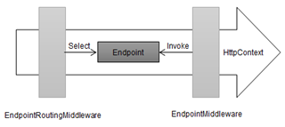

Chapter 13-URL Routing
==============================

URL routing solves these problems by introducing middleware (actually two middlewares) that takes care of matching request URLs so that components, called endpoints, can focus on responses. The mapping between endpoints and the URLs they require is expressed in a ***route***. The routing middleware processes the URL, inspects the set of routes and finds the endpoint to handle the request, a process known as ***routing***. An endpoint represents a handler (`RequestDelegate`) for a request, and it also provides a container for metadata, Many behaviors in the routing process can be controlled by the corresponding metadata:


In ASP.NET Core 3, routing is consisted of two processes: Endpoint Selection and Endpoint Invoke



```C#
public class Startup 
{
   public void ConfigureServices(IServiceCollection services) { }

   public void Configure(IApplicationBuilder app, IWebHostEnvironment env) {
      ...
      app.Map("/branch", app => { 
         app.Run(new QueryStringMiddleWare().Invoke);
      });

      app.UseRouting();  // <---------------------------------A (select an endpint) using EndpointRoutingMiddleware
                         //EndpointRoutingMiddleware will associate the endpoint with HttpContext, it will also set HttpContext's RouteValueDictionary values
     
      app.Use(async (context, next) => {
         Endpoint end = context.GetEndpoint();
         if (end != null) {
            await context.Response.WriteAsync($"{end.DisplayName} Selected \n");
         } else {
            await context.Response.WriteAsync("No Endpoint Selected \n");
         }
         await next();
      });
  
      app.UseEndpoints(endpoints => {  // <------------------ B (register mapping and invoke endpoint), using EndpointRoutingMiddleware
         
         endpoints.MapGet("routing", async context => {    // endpoints is IEndpointRouteBuilder
            await context.Response.WriteAsync("Request Was Routed");
         });

         endpoints.MapGet("{first}/{second}/{third}", async context => { 
            foreach (var kvp in context.Request.RouteValues) {
               await context.Response.WriteAsync($"{kvp.Key}: {kvp.Value}\n");
            }
         });

         endpoints.Map("{number:int}", async context => {
            await context.Response.WriteAsync("Routed to the int endpoint");
         })
         .WithDisplayName("Int Endpoint")                  // WithDisplayName is an extension method of IEndpointConventionBuilder
         .Add(b => ((RouteEndpointBuilder)b).Order = 1);   // Add is the native method of IEndpointConventionBuilder

          endpoints.Map("{number:double}", async context => {
            await context.Response.WriteAsync("Routed to the double endpoint");
         })
         .WithDisplayName("Double Endpoint")
         .Add(b => ((RouteEndpointBuilder)b).Order = 2);
      });

      app.Use(async (context, next) => {
         await context.Response.WriteAsync("Terminal Middleware Reached");
      });
   }
}
```

## Demystifying Routing Process

1. `EndpointRoutingMiddleware` middleware (Part A)
2. `EndpointMiddleware` middleware (Part B)

#### Part A

**a1**: When `app.UseRouting()` is called, first .net checks if `service.AddRouting()` is called. Check the DI part in the next section for details. Note that you don't need to call `service.AddRouting()` manually, `Host.CreateDefaultBuilder()` will call it automatically.

**a2**: `ApplicationBuilder.Properties` will be associated with an `DefaultEndpointRouteBuilder`:

 

`DefaultEndpointRouteBuilder` represents a collection of Endpoint instances as `EndpointDataSource`: 

 

note that `DefaultEndpointRouteBuilder.DataSources` stores a collection of `ModelEndpointDataSource` (see s1), which is setup by part B

**a3**: `EndpointRoutingMiddleware` middleware is used.

**a4**: `DfaMatcher` will associate an endpoint to the `HttpContext` object

#### Part B

**b1**: checks if `service.AddRouting()` is called, same as a1

**b2**: remember in a2 we associate a DefaultEndpointRouteBuilder in ApplicationBuilder's property? See the exampleA and MapExtensions's Map() method to see how it create `ApplicationBuilder.New()`, then you will see why we use `object.ReferenceEquals()` to make sure there is matching `UseRouing` and `UseEndpoints`.
The main purpose of b2 is to retrieve the `DefaultEndpointRouteBuilder` that is created from Part A, so that it can be used at b3.

**b3**: `MapMethods()` extension method is called; then `RoutePatternFactory.Parse(pattern)` is passed to the Map method. If you do sth like `RoutePattern rt = RoutePatternFactory.Parse("api/{first=syndey}/{second}/{third}");`, `RoutePattern` would be sth like:

 

b3 is quite important, so I will explain it in a seperate section

**b4**: create an instance of `RouteEndpointBuilder` which is a specific version of `EndpointBuilder`, this instance will be attached to DefaultEndpointRouteBuilder in b6

**b5**: `DefaultEndpointRouteBuilder.DataSources` will store an instance of `ModelEndpointDataSource` (see s1)

**b6**: The AddEndpointBuilder method of the instance `ModelEndpointDataSource` created at b5 will be passed with the instance of `RouteEndpointBuilder` created at b4. An instance of `DefaultEndpointConventionBuilder` will be created, and `ModelEndpointDataSource` instance's _endpointConventionBuilders property will contain it.

Now the picture is like:

`DefaultEndpointRouteBuilder.DataSources` -> `ModelEndpointDataSource`
`ModelEndpointDataSource._endpointConventionBuilders` -> `DefaultEndpointConventionBuilder`

```C#
//-----------------V
public static class EndpointRoutingApplicationBuilderExtensions     
{  
   private const string EndpointRouteBuilder = "__EndpointRouteBuilder";
   private const string GlobalEndpointRouteBuilderKey = "__GlobalEndpointRouteBuilder";
   //...

   /*
   UseRouting's job is: 
     1. Create a IEndpointRouteBuilder instance and stored in IApplicationBuilder.Properties
     2. Use EndpointRoutingMiddleware middleware   
   */
   public static IApplicationBuilder UseRouting(this IApplicationBuilder builder) {  // <----------------------A
      // checks if service.AddRouting() is called
      VerifyRoutingServicesAreRegistered(builder);  // <---------a1

      IEndpointRouteBuilder endpointRouteBuilder;
      if (builder.Properties.TryGetValue(GlobalEndpointRouteBuilderKey, out var obj)) {
         endpointRouteBuilder = (IEndpointRouteBuilder)obj!;
         // let interested parties know if UseRouting() was called while a global route builder was set
         builder.Properties[EndpointRouteBuilder] = endpointRouteBuilder;
      } else {
         endpointRouteBuilder = new DefaultEndpointRouteBuilder(builder);  // <---------a2
         builder.Properties[EndpointRouteBuilder] = endpointRouteBuilder;  // <-----------------  IEndpointRouteBuilder is saved in ApplicationBuilder.Properties
      }
      return builder.UseMiddleware<EndpointRoutingMiddleware>(endpointRouteBuilder); // <---------a3
   }

   public static IApplicationBuilder UseEndpoints(this IApplicationBuilder builder, Action<IEndpointRouteBuilder> configure) {  // B
       VerifyRoutingServicesAreRegistered(builder); // <---------b1
       VerifyEndpointRoutingMiddlewareIsRegistered(builder, out var endpointRouteBuilder);   // <---------b2
       configure(endpointRouteBuilder);   // <-------------b3, this applies the changes you write : endpoints.MapControllers() or endpoints.MapGet("{first}/{second}/{third}", ...) 

       var routeOptions = builder.ApplicationServices.GetRequiredService<IOptions<RouteOptions>>();
       foreach (var dataSource in endpointRouteBuilder.DataSources) {   
          if (!routeOptions.Value.EndpointDataSources.Contains(dataSource)) {
             routeOptions.Value.EndpointDataSources.Add(dataSource);   // <-------------------------b7?
          }
       }

       return builder.UseMiddleware<EndpointMiddleware>();  // <-------------------------b8
   }

   private static void VerifyRoutingServicesAreRegistered(IApplicationBuilder app) {  // <---------a1
      // verify if `service.AddRouting()` was called before calling UseEndpointRouting/UseEndpoint
      if (app.ApplicationServices.GetService(typeof(RoutingMarkerService)) == null) {   // RoutingMarkerService is just a marker class
         throw new InvalidOperationException(...);
      }
   }

   private static void VerifyEndpointRoutingMiddlewareIsRegistered(IApplicationBuilder app, out IEndpointRouteBuilder endpointRouteBuilder) {
      if (!app.Properties.TryGetValue(EndpointRouteBuilder, out var obj)) {  // a2 adds IEndpointRouteBuilder to application builder's property
         throw new InvalidOperationException("Please add UseRouting to use EndpointRoutingMiddleware");
      }

      endpointRouteBuilder = (IEndpointRouteBuilder)obj!;

      // this check handles the case where Map(...) that forks the pipeline has a matching UseRouting() and UseEndpoints(), see exampleA
      if (endpointRouteBuilder is DefaultEndpointRouteBuilder defaultRouteBuilder && !object.ReferenceEquals(app, defaultRouteBuilder.ApplicationBuilder)) {
         var message = "EndpointRoutingMiddleware and EndpointMiddleware must be added to the same IApplicationBuilder instance ...";
         throw new InvalidOperationException(message);
      }
   }
}
//--------------------V
internal sealed partial class EndpointRoutingMiddleware {   // <---------a3
   private readonly MatcherFactory _matcherFactory;
   private readonly ILogger _logger;
   private readonly EndpointDataSource _endpointDataSource;
   private readonly DiagnosticListener _diagnosticListener;
   private readonly RequestDelegate _next;

   public EndpointRoutingMiddleware(
      MatcherFactory matcherFactory, 
      ILogger<EndpointRoutingMiddleware> logger,
      IEndpointRouteBuilder endpointRouteBuilder,  // I think it is the one pass the UseMiddlware method, and ActivatorUtilities.CreateInstance is smart enough to detect?
      DiagnosticListener diagnosticListener,
      RequestDelegate next)
   {
      // endpointRouteBuilder.DataSources is ICollection<EndpointDataSource>  
      // where EndpointDataSource represents a list of Endpoint
      // CompositeEndpointDataSource can takes a list of EndpointDataSource
      _endpointDataSource = new CompositeEndpointDataSource(endpointRouteBuilder.DataSources);                                                                                     
   }

   public Task Invoke(HttpContext httpContext) 
   {
      var endpoint = httpContext.GetEndpoint();  // there is already an endpoint, skip matching completely
      if (endpoint != null) {
         return _next(httpContext);
      }

      // ...
      
      // matcher is DfaMatcher whose job is to associate an endpoint to a HttpContext (by analysing httpContext.Request.Path.Value) 
      // using a complex process to determine which endpoints to associate
      var matcher = _matcherFactory.CreateMatcher(_endpointDataSource);   // <---------------------- we pass IEndpointRouteBuilder.DataSources that contains RouteEndpointBuilder 
                                                                          // which contains RequestDelegate and RoutePattern, so DfaMatcher can match it

     
      // call httpContext.SetEndpoint(candidate.Endpoint) when find a candicate
      await matcher.MatchAsync(httpContext);    // <-------------------------------------a4
     
      // ... tweak the code, inline sepearate private method
      var endpoint = httpContext.GetEndpoint();
      if (endpoint == null) {   //  DfaMatcher didn't find any matching
          Log.MatchFailure(_logger);  
      } else {
         // ...
         Log.MatchSuccess(_logger, endpoint);
      }

      return _next(httpContext);       
   }
}
//--------------------Ʌ

//--------------V
public interface IEndpointFeature
{
   Endpoint? Endpoint { get; set; }
}

public static class EndpointHttpContextExtensions
{
   public static Endpoint GetEndpoint(this HttpContext context)
   {
      return context.Features.Get<IEndpointFeature>().Endpoint;
   }

   public static void SetEndpoint(this HttpContext context, Endpoint endpoint)  // DFA matcher will add the matched endpoint to HttpContext's Feature property
   {
      var feature = context.Features.Get<IEndpointFeature>();
       // ...  null check, if null do `feature = new EndpointFeature()`
      feature.Endpoint = endpoint;
   }
}
//--------------Ʌ

//--------------------V
internal abstract class Matcher
{
   // find and set an Endpoint to HttpContext using the extension method of HttpContext.SetEndpoint()
   public abstract Task MatchAsync(HttpContext httpContext);
}

internal sealed class DfaMatcher : Matcher   
{
   // ...
   private readonly EndpointSelector _selector;   // <-----------------

   public sealed override Task MatchAsync(HttpContext httpContext)  // <------------------a4
   {  
      var path = httpContext.Request.Path.Value!;
      
      // First tokenize the path into series of segments.
      Span<PathSegment> buffer = stackalloc PathSegment[_maxSegmentCount];
      var count = FastPathTokenizer.Tokenize(path, buffer);
      var segments = buffer.Slice(0, count);
      
      var (candidates, policies) = FindCandidateSet(httpContext, path, segments);
      var candidateCount = candidates.Length;
      if (candidateCount == 0) {
         return Task.CompletedTask;
      }

      var policyCount = policies.Length;
      // This is a fast path for single candidate, 0 policies and default selector
      if (candidateCount == 1 && policyCount == 0 && _isDefaultEndpointSelector) {
         // Just strict path matching (no route values)
         if (candidate.Flags == Candidate.CandidateFlags.None) {
            httpContext.SetEndpoint(candidate.Endpoint);  // <--------------------------------------------------------------------------------- 
            return Task.CompletedTask;
         }
      }

      // ... complicated matching process

      if (policyCount == 0 && _isDefaultEndpointSelector) 
      {
         DefaultEndpointSelector.Select(httpContext, candidateState);   // <--------------------- eventually call httpContext.SetEndpoint()
         return Task.CompletedTask;
      }
      else if (policyCount == 0)
      {
         // ...
      }

      // ...
   }

   // ...
}
//--------------------Ʌ
//--------------------V
public interface IEndpointFeature {
   Endpoint? Endpoint { get; set; }
}

public static class EndpointHttpContextExtensions {

   public static Endpoint GetEndpoint(this HttpContext context) {

      return context.Features.Get<IEndpointFeature>()?.Endpoint;
   }

   public static void SetEndpoint(this HttpContext context, Endpoint endpoint) {   // <------------------------

      var feature = context.Features.Get<IEndpointFeature>();

      if (feature == null) {
         feature = new EndpointFeature();
         context.Features.Set(feature);
      }

      feature.Endpoint = endpoint;
   }

   private class EndpointFeature : IEndpointFeature {
      public Endpoint? Endpoint { get; set; }
   }
}
//--------------------Ʌ
//--------------------V
public abstract class EndpointSelector   
{  
   public abstract Task SelectAsync(HttpContext httpContext, CandidateSet candidates);
}

internal sealed class DefaultEndpointSelector : EndpointSelector {

   public override Task SelectAsync(HttpContext httpContext, CandidateSet candidateSet) {
      Select(httpContext, candidateSet.Candidates);
      return Task.CompletedTask;
   }
   
   // ...

   internal static void Select(HttpContext httpContext, CandidateState[] candidateState) {
      
      switch (candidateState.Length) {

         case 0: {
            break;
         }
         
         case 1: {
            ref var state = ref candidateState[0];
            if (CandidateSet.IsValidCandidate(ref state)) {
               httpContext.SetEndpoint(state.Endpoint);            // <-------------------------------------------- associate HttpContext with an endpoint
               httpContext.Request.RouteValues = state.Values;    // <--------------------------------------------- setup RouteValues
            }
            break;
         }

         default: {
            ProcessFinalCandidates(httpContext, candidateState);  // slow path, There's more than one candidate (to say nothing of validity) so we have to process for ambiguities
                                                                  // compare each matching candidate's score to determine which one suits the most
            break;
         }
      }
   }
}
//--------------------Ʌ
//--------------------V
public sealed class CandidateSet {  // represent a set of Endpoint candidates that have been matched
   
   internal CandidateState[] Candidates;

   public CandidateSet(Endpoint[] endpoints, RouteValueDictionary[] values, int[] scores) {  // The list of endpoints, sorted in descending priority order
      
      if (endpoints.Length != values.Length || endpoints.Length != scores.Length) {
         throw new ArgumentException($"The provided {nameof(endpoints)}, {nameof(values)}, and {nameof(scores)} must have the same length.");
      }

      Candidates = new CandidateState[endpoints.Length];
      for (var i = 0; i < endpoints.Length; i++) {
         Candidates[i] = new CandidateState(endpoints[i], values[i], scores[i]);
      }
   }
   // ...
   internal static bool IsValidCandidate(ref CandidateState candidate) {
      return candidate.Score >= 0;
   }
}

public struct CandidateState {  // the state associated with a candidate in a CandidateSet

   internal CandidateState(Endpoint endpoint, int score) {
      Endpoint = endpoint;
      Score = score;
      Values = null;
   }

   internal CandidateState(Endpoint endpoint, RouteValueDictionary? values, int score) {
      // ...
   }

   public Endpoint Endpoint { get; }
   public int Score { get; }
   public RouteValueDictionary? Values { get; internal set; }
}

internal readonly struct Candidate {

   public readonly Endpoint Endpoint;
   public readonly CandidateFlags Flags;
   // data for creating the RouteValueDictionary. We assign each key its own slot
   // then when we process parameters, we don't need to operate on the RouteValueDictionary 
   // we can just operate on an array, which is much much faster.
   public readonly KeyValuePair<string, object>[] Slots;
   // list of parameters to capture
   public readonly (string parameterName, int segmentIndex, int slotIndex)[] Captures;
   public readonly (RoutePatternPathSegment pathSegment, int segmentIndex)[] ComplexSegments;
   public readonly KeyValuePair<string, IRouteConstraint>[] Constraints;
   public readonly int Score;

   public Candidate(
      Endpoint endpoint,
      int score,
      KeyValuePair<string, object>[] slots,
      (string parameterName, int segmentIndex, int slotIndex)[] captures,
      in (string parameterName, int segmentIndex, int slotIndex) catchAll,
      (RoutePatternPathSegment pathSegment, int segmentIndex)[] complexSegments,
      KeyValuePair<string, IRouteConstraint>[] constraints)
   {
      Endpoint = endpoint;
      Score = score;
      // ...
      Flags = CandidateFlags.None;
      for (var i = 0; i < slots.Length; i++) {
         if (slots[i].Key != null) {
            Flags |= CandidateFlags.HasDefaults;
         }
         // ...
         if (catchAll.parameterName != null) {
            Flags |= CandidateFlags.HasCatchAll;
         }
         // ...
      }
   }
   [Flags]
   public enum CandidateFlags {
      None = 0,
      HasDefaults = 1,
      HasCaptures = 2,
      HasCatchAll = 4,
      HasSlots = HasDefaults | HasCaptures | HasCatchAll,
      HasComplexSegments = 8,
      HasConstraints = 16,
   }
}
//--------------------Ʌ

//--------------------------------------V
public abstract class EndpointDataSource {    // provides a collection of Endpoint instances.
   public abstract IChangeToken GetChangeToken();
   public abstract IReadOnlyList<Endpoint> Endpoints { get; }
}

public sealed class DefaultEndpointDataSource : EndpointDataSource {  

   private readonly IReadOnlyList<Endpoint> _endpoints;

   public DefaultEndpointDataSource(IEnumerable<Endpoint> endpoints) {
      _endpoints = new List<Endpoint>(endpoints);
   }
   // public override IChangeToken GetChangeToken() => NullChangeToken.Singleton;
   public override IReadOnlyList<Endpoint> Endpoints => _endpoints;
}

public sealed class CompositeEndpointDataSource : EndpointDataSource {   // represents a collection of EndpointDataSource
                                                                         // too complicated, don't worry about it atm
   // private readonly object _lock;
   // private IChangeToken _consumerChangeToken;
   private CancellationTokenSource _cts;
   private readonly ICollection<EndpointDataSource> _dataSources = default!;
   private IReadOnlyList<Endpoint> _endpoints = default!;
   
   public CompositeEndpointDataSource(IEnumerable<EndpointDataSource> endpointDataSources) : this() {
      _dataSources = new List<EndpointDataSource>();
      foreach (var dataSource in endpointDataSources) {
         _dataSources.Add(dataSource);
      }
   }

   public IEnumerable<EndpointDataSource> DataSources => _dataSources;
} 

//-------------------------------------V
internal class ModelEndpointDataSource : EndpointDataSource {  // <----------s1

   private readonly List<DefaultEndpointConventionBuilder> _endpointConventionBuilders;

   public ModelEndpointDataSource() {
      _endpointConventionBuilders = new List<DefaultEndpointConventionBuilder>();
   }

   public IEndpointConventionBuilder AddEndpointBuilder(EndpointBuilder endpointBuilder) {
      var builder = new DefaultEndpointConventionBuilder(endpointBuilder);  // <---------------b6.2
      _endpointConventionBuilders.Add(builder);

      return builder;
   }

   public override IReadOnlyList<Endpoint> Endpoints => _endpointConventionBuilders.Select(e => e.Build()).ToArray();
}
//-------------------------------------Ʌ
//--------------------V
public class Endpoint {  // namespace Microsoft.AspNetCore.Http;
    public Endpoint(RequestDelegate? requestDelegate, EndpointMetadataCollection? metadata, string? displayName) {
       //...
    }
    public string DisplayName { get; }
    public EndpointMetadataCollection Metadata { get; }
    public RequestDelegate? RequestDelegate { get; }
    public override string? ToString() => DisplayName ?? base.ToString();
}

public sealed class RouteEndpoint : Endpoint {  // namespace Microsoft.AspNetCore.Routing;
   public RouteEndpoint(RequestDelegate requestDelegate, RoutePattern routePattern, int order, 
                        EndpointMetadataCollection? metadata, string? displayName) : base(requestDelegate, metadata, displayName)
   {
      RoutePattern = routePattern;
      Order = order;
   }

   public int Order { get; }
   public RoutePattern RoutePattern { get; }
}
//-------------------Ʌ

//------------------------------------V
public interface IEndpointRouteBuilder {    // this has no Build() method
   IApplicationBuilder CreateApplicationBuilder();
   IServiceProvider ServiceProvider { get; }
   ICollection<EndpointDataSource> DataSources { get; }  // this property stores a collection of ModelEndpointDataSource  <----------s1
}

internal class DefaultEndpointRouteBuilder : IEndpointRouteBuilder {
   public DefaultEndpointRouteBuilder(IApplicationBuilder applicationBuilder) {
      ApplicationBuilder = applicationBuilder;
      DataSources = new List<EndpointDataSource>();
   }

   public IApplicationBuilder ApplicationBuilder { get; }

   public IApplicationBuilder CreateApplicationBuilder() 
   {
      ApplicationBuilder.New();
   }
   public ICollection<EndpointDataSource> DataSources { get; }   

   public IServiceProvider ServiceProvider => ApplicationBuilder.ApplicationServices;
}
//-------------------Ʌ
```
```C#
//-----------------------------------------------------------------------------------------------------------------------------------------
public static class EndpointRouteBuilderExtensions {   // namespace Microsoft.AspNetCore.Builder;
   private static readonly string[] GetVerb = new[] { HttpMethods.Get };
   private static readonly string[] PostVerb = new[] { HttpMethods.Post };
   ...
   private static readonly string[] PatchVerb = new[] { HttpMethods.Patch };

   public static IEndpointConventionBuilder MapGet(this IEndpointRouteBuilder endpoints, string pattern, RequestDelegate requestDelegate) {
      return MapMethods(endpoints, pattern, GetVerb, requestDelegate);   // <----------------b3
   }

   public static IEndpointConventionBuilder MapPost(this IEndpointRouteBuilder endpoints, string pattern, RequestDelegate requestDelegate) {
      return MapMethods(endpoints, pattern, PutVerb, requestDelegate);
   }
   ...
   //  routes requests made with one of the specified HTTP methods (represented as IEnumerable<string>) that match the URL pattern to the endpoint.
   public static IEndpointConventionBuilder MapMethods(this IEndpointRouteBuilder endpoints, string pattern, IEnumerable<string> httpMethods, RequestDelegate handler) {
      // ...
      IEndpointConventionBuilder builder = endpoints.Map(RoutePatternFactory.Parse(pattern), requestDelegate);   // <----------------b3!
      // Prepends the HTTP method to the DisplayName produced with pattern + method name
      builder.WithDisplayName($"{pattern} HTTP: {string.Join(", ", httpMethods)}");       // <--------------b7.1
      builder.WithMetadata(new HttpMethodMetadata(httpMethods));                          // <--------------b7.2
      return builder;
   }

   // Adds a RouteEndpoint to the IEndpointRouteBuilder that matches HTTP requests for the specified pattern.
   public static IEndpointConventionBuilder Map(this IEndpointRouteBuilder endpoints, RoutePattern pattern, RequestDelegate requestDelegate) {  // <-------b4
      
      const int defaultOrder = 0;

      var builder = new RouteEndpointBuilder(requestDelegate, pattern, defaultOrder) {  // <--------------b4
         DisplayName = pattern.RawText
      }

      // Add delegate attributes as metadata
      var attributes = requestDelegate.Method.GetCustomAttributes();

      foreach (var attribute in attributes) {
         builder.Metadata.Add(attribute);
      }

      var dataSource = endpoints.DataSources.OfType<ModelEndpointDataSource>().FirstOrDefault();
      if (dataSource == null) {
         dataSource = new ModelEndpointDataSource();
         endpoints.DataSources.Add(dataSource);   // <------------------b5
      }

      return dataSource.AddEndpointBuilder(builder);  // <--------------b6.1
   }
   // ...
}

//-----------------V
public static class RoutingEndpointConventionBuilderExtensions {  
   
   // the purpose of these extension method is to add a Action delegate to the DefaultEndpointConventionBuilder._conventions (List<Action<EndpointBuilder>>) 
   // which can control the EndpointBuilder later

   public static TBuilder WithDisplayName<TBuilder>(this TBuilder builder, string displayName) where TBuilder : IEndpointConventionBuilder {
      builder.Add(b => {
         b.DisplayName = displayName;
      });
   }
   
   public static TBuilder WithMetadata<TBuilder>(this TBuilder builder, params object[] items) where TBuilder : IEndpointConventionBuilder {
      builder.Add(b => 
      {
         foreach (var item in items) {
            b.Metadata.Add(item);
         }
      });
   }
   // ...
}
//-----------------Ʌ
```
```C#
//--------------------------------------V
public abstract class EndpointBuilder {   // a base class for building an new Endpoint

   public RequestDelegate? RequestDelegate { get; set; }

   public string? DisplayName { get; set; }

   public IList<object> Metadata { get; } = new List<object>();
   
   public abstract Endpoint Build();
}

public sealed class RouteEndpointBuilder : EndpointBuilder {
   public RoutePattern RoutePattern { get; set; }
   public int Order { get; set; }

   public RouteEndpointBuilder(RequestDelegate requestDelegate, RoutePattern routePattern, int order) {
      // ...
   }

   public override Endpoint Build() {
      RouteEndpoint routeEndpoint = new RouteEndpoint(RequestDelegate, RoutePattern, Order, new EndpointMetadataCollection(Metadata), DisplayName);
      return routeEndpoint;
   }
}
//--------------------------------------Ʌ

//-------------------V
public class Endpoint {
    public Endpoint(RequestDelegate? requestDelegate, EndpointMetadataCollection? metadata, string? displayName) {
       // ...
    }
    public string? DisplayName { get; }
    public EndpointMetadataCollection Metadata { get; }
    public RequestDelegate? RequestDelegate { get; }
    public override string? ToString() => DisplayName ?? base.ToString();
}

public sealed class RouteEndpoint : Endpoint {
   // ... same as Endpoint except two things below
   public int Order { get; }
   public RoutePattern RoutePattern { get; }
}
//-------------------Ʌ

//-----------------------------------------V
public interface IEndpointConventionBuilder 
{ 
   void Add(Action<EndpointBuilder> convention);
}

internal class DefaultEndpointConventionBuilder : IEndpointConventionBuilder {   
   
   internal EndpointBuilder EndpointBuilder { get; }

   private List<Action<EndpointBuilder>>? _conventions;

   public DefaultEndpointConventionBuilder(EndpointBuilder endpointBuilder) {
      EndpointBuilder = endpointBuilder;
      _conventions = new();
   }

   public void Add(Action<EndpointBuilder> convention) {
       _conventions.Add(convention);
   }

   public Endpoint Build() {
      // ... Interlocked.Exchange() thing to make sure convention only apply once

      if (conventions is not null) {
         foreach (var convention in conventions) 
         {
            convention(EndpointBuilder);
         }
      }

      return EndpointBuilder.Build();
   }
}
//-----------------------------------------Ʌ

// metadata used during link generation to find the associated endpoint using route name
public sealed class RouteNameMetadata : IRouteNameMetadata {
   public RouteNameMetadata(string? routeName) {
      RouteName = routeName;
   }

   public string? RouteName { get; }
}

public static class RoutingEndpointConventionBuilderExtensions {
   public static TBuilder WithMetadata<TBuilder>(this TBuilder builder, params object[] items) where TBuilder : IEndpointConventionBuilder {
      builder.Add(b => {
         foreach (var item in items) {
            b.Metadata.Add(item);
         }
      });
   }
}


//-------------------V
public interface IParameterPolicy { }  // a marker interface for types that are associated with route parameters

public interface IRouteConstraint : IParameterPolicy {
   bool Match(HttpContext httpContext, IRouter route, string routeKey, RouteValueDictionary values, RouteDirection routeDirection);
}
//-------------------Ʌ
```
```C#
//---------------------------V
internal sealed partial class EndpointMiddleware   // this middleware is quite simple, just executes the chosen endpoint
{
   internal const string AuthorizationMiddlewareInvokedKey = "__AuthorizationMiddlewareWithEndpointInvoked";
   internal const string CorsMiddlewareInvokedKey = "__CorsMiddlewareWithEndpointInvoked";

   private readonly ILogger _logger;
   private readonly RequestDelegate _next;
   private readonly RouteOptions _routeOptions;

   public EndpointMiddleware(ILogger<EndpointMiddleware> logger, RequestDelegate next, IOptions<RouteOptions> routeOptions) 
   {
      // ...
   }

   public Task Invoke(HttpContext httpContext) 
   {
      var endpoint = httpContext.GetEndpoint();
      if (endpoint?.RequestDelegate != null) 
      {
         if (!_routeOptions.SuppressCheckForUnhandledSecurityMetadata)
         {
            if (endpoint.Metadata.GetMetadata<IAuthorizeData>() != null && !httpContext.Items.ContainsKey(AuthorizationMiddlewareInvokedKey)) {
               ThrowMissingAuthMiddlewareException(endpoint);
            }

            if (endpoint.Metadata.GetMetadata<ICorsMetadata>() != null && !httpContext.Items.ContainsKey(CorsMiddlewareInvokedKey)) {
               ThrowMissingCorsMiddlewareException(endpoint);
            }
         }

         Log.ExecutingEndpoint(_logger, endpoint);

         try {                      // execute endpoint's delegate        this is when Controller and ActionContext instance is created 
            var requestTask = endpoint.RequestDelegate(httpContext);     // <-----------------------------check ActionEndpointFactory in "Demystifying ControllerActionInvoker"
            if (!requestTask.IsCompletedSuccessfully) {
               return AwaitRequestTask(endpoint, requestTask, _logger);  // if endpoint found and executed successfully, return immediately, 
                                                                         // therefore short circuit the rest of middlewares
            }
         }
         catch (Exception exception) {
            Log.ExecutedEndpoint(_logger, endpoint);
            return Task.FromException(exception);
         }

         Log.ExecutedEndpoint(_logger, endpoint);
         return Task.CompletedTask;  // <------------
      }                                           //| <----------- now you see why if there is a matched endpoint, then 'outer' middleware will be ignored,
                                                  //|              there is what the 'end' in 'endpoint' is all ablout
      return _next(httpContext);     // <------------    
   }
}
//---------------------------Ʌ
```

-------------------------------------------------------------------------------------------------------------------------------
Let's put endpoint register in dissection:

```C#
public class Startup 
{
   public void ConfigureServices(IServiceCollection services) { }

   public void Configure(IApplicationBuilder app, IWebHostEnvironment env) {
      // ......
      app.UseRouting();  

      app.UseEndpoints(endpoints =>   // endpoints is IEndpointRouteBuilder
      {  
         endpoints.Map("{number:int}", async context => {     // <----------------------------------------- we will look at this one
            await context.Response.WriteAsync("Routed to the int endpoint");
         })
         .WithDisplayName("Int Endpoint")                 
         .Add(b => ((RouteEndpointBuilder)b).Order = 1); 

         endpoints.Map("{number:double}", async context => {
            await context.Response.WriteAsync("Routed to the double endpoint");
         })
         .WithDisplayName("Double Endpoint")                 
         .Add(b => ((RouteEndpointBuilder)b).Order = 2);
      });
   }
}

public static class EndpointRoutingApplicationBuilderExtensions 
{
   public static IApplicationBuilder UseEndpoints(this IApplicationBuilder builder, Action<IEndpointRouteBuilder> configure) 
   {   
      // step 1
      VerifyEndpointRoutingMiddlewareIsRegistered(builder, out var endpointRouteBuilder);   // call !app.Properties.TryGetValue(EndpointRouteBuilder, out var obj) internally
      
      // step 2
      configure(endpointRouteBuilder); 

      // this part is complicated and related to discovery of endpoints or URL generation, don't worry about it
      var routeOptions = builder.ApplicationServices.GetRequiredService<IOptions<RouteOptions>>();
      foreach (var dataSource in endpointRouteBuilder.DataSources) {   
         if (!routeOptions.Value.EndpointDataSources.Contains(dataSource)) {
            routeOptions.Value.EndpointDataSources.Add(dataSource);   
         }
      }
      //
      
      // step 3
      return builder.UseMiddleware<EndpointMiddleware>();  
   }
}
```

1.  `UseEndpoints` extension method is called, `IEndpointRouteBuilder`(`DefaultEndpointRouteBuilder`) instance is retrieved from `ApplicationBuilder.Properties`

```C#
public interface IApplicationBuilder {   
   IServiceProvider ApplicationServices { get; set; }
   IFeatureCollection ServerFeatures { get; }
   IDictionary<string, object?> Properties { get; }  // <-----------------------------------------
   IApplicationBuilder Use(Func<RequestDelegate, RequestDelegate> middleware);
   IApplicationBuilder New();
   RequestDelegate Build();
}
```

2. `endpoints.Map("{number:int}", ...)` is invoke where `endpoints` is `DefaultEndpointRouteBuilder`, so `Map()` extension method is called on it:
   **2.1a**: `RoutePatternParser` (via `RoutePatternFactory`) first parses the "{number:int}" string into a `RoutePattern` which contains some `IReadOnlyDictionary` of
          defaults, requiredValues, parameters, for example, you can do
   ```C#
   RoutePattern pattern = RoutePatternFactory.Parse("{controller=Home}/{action=Index}/{id?}");

   public sealed class RoutePattern
   {
      /*
      key: controller, value: Home
      key: action, value: Index
      */
      IReadOnlyDictionary<string, object?> defaults;

      // 3 RoutePatternParameterPart instances
      IReadOnlyList<RoutePatternParameterPart> parameters;
      // ...
   }
   ```
   
```C#
public static class EndpointRouteBuilderExtensions
{
   public static IEndpointConventionBuilder MapGet(this IEndpointRouteBuilder endpoints, string pattern, RequestDelegate requestDelegate)
   {
      return MapMethods(endpoints, pattern, GetVerb, requestDelegate);
   }

   public static IEndpointConventionBuilder MapMethods(this IEndpointRouteBuilder endpoints, string pattern, IEnumerable<string> httpMethods, RequestDelegate handler)
   {
      // step 2.1a                                   // RoutePatternFactory creates RoutePattern (via RoutePatternParser whose job is to analyse "{number:int}" string )
      IEndpointConventionBuilder builder = endpoints.Map(RoutePatternFactory.Parse(pattern), requestDelegate);  

      builder.WithDisplayName($"{pattern} HTTP: {string.Join(", ", httpMethods)}"); 
      
      builder.WithMetadata(new HttpMethodMetadata(httpMethods));
      
      return builder;
   }

   // step 2.1b
   public static IEndpointConventionBuilder Map(this IEndpointRouteBuilder endpoints, RoutePattern pattern, RequestDelegate requestDelegate) 
   {  
      const int defaultOrder = 0;

      var builder = new RouteEndpointBuilder(requestDelegate, pattern, defaultOrder) {   // associate the user defined delegate to RouteEndpointBuilder, when Build() method called
         DisplayName = pattern.RawText                                                   // it returns the Endpoint that has the delegate. Now you see how your RequestDelegate
      }                                                                                  // is attached to the Endpoint

      var attributes = requestDelegate.Method.GetCustomAttributes();

      foreach (var attribute in attributes) {
         builder.Metadata.Add(attribute);
      }

      var dataSource = endpoints.DataSources.OfType<ModelEndpointDataSource>().FirstOrDefault();
      if (dataSource == null) {
         dataSource = new ModelEndpointDataSource();
         endpoints.DataSources.Add(dataSource);  
      }

      return dataSource.AddEndpointBuilder(builder); 
   }
}
```

3. `EndpointMiddleware` will execute the Endpointer that matched and set by `EndpointRoutingMiddleware`. 
----------------------------------------------------------------------------------------------------------------

```C#
public class RouteOptions   // represent the configurable options on a route.
{
   private IDictionary<string, Type> _constraintTypeMap = GetDefaultConstraintMap();
   private ICollection<EndpointDataSource> _endpointDataSources = default!;

   internal ICollection<EndpointDataSource> EndpointDataSources {
      get {
         Debug.Assert(_endpointDataSources != null, "Endpoint data sources should have been set in DI.");
         return _endpointDataSources;
      }
      set => _endpointDataSources = value;
   }

   public bool LowercaseUrls { get; set; }
   public bool LowercaseQueryStrings { get; set; }
   public bool AppendTrailingSlash { get; set; }
   public bool SuppressCheckForUnhandledSecurityMetadata { get; set; }
   public IDictionary<string, Type> ConstraintMap { get; set; }

   private static IDictionary<string, Type> GetDefaultConstraintMap()  // <------------------------------c2
   {
      var defaults = new Dictionary<string, Type>(StringComparer.OrdinalIgnoreCase);

      // Type-specific constraints
      AddConstraint<IntRouteConstraint>(defaults, "int");
      AddConstraint<BoolRouteConstraint>(defaults, "bool");
      AddConstraint<DateTimeRouteConstraint>(defaults, "datetime");
      // ...

      // Length constraints
      AddConstraint<MinLengthRouteConstraint>(defaults, "minlength");
      AddConstraint<MaxLengthRouteConstraint>(defaults, "maxlength");
      AddConstraint<LengthRouteConstraint>(defaults, "length");

      // Min/Max value constraints
      AddConstraint<MinRouteConstraint>(defaults, "min");
      AddConstraint<MaxRouteConstraint>(defaults, "max");
      AddConstraint<RangeRouteConstraint>(defaults, "range");

      // ... Regex-based constraints and other

      return defaults;
   }

   private static void AddConstraint<TConstraint>(Dictionary<string, Type> constraintMap, string text) where TConstraint : IRouteConstraint
   {
      constraintMap[text] = typeof(TConstraint);
   }
   // ... SetParameterPolicy related
}

public static class RoutePatternFactory {   // namespace Microsoft.AspNetCore.Routing.Patterns;
   ...
   public static RoutePattern Parse(string pattern) {
      return RoutePatternParser.Parse(pattern);
   }
}

internal static class RoutePatternParser {
   private const char Separator = '/';
   private const char OpenBrace = '{';
   private const char CloseBrace = '}';
   private const char QuestionMark = '?';
   private const char Asterisk = '*';  
   private const string PeriodString = ".";

   internal static readonly char[] InvalidParameterNameChars = new char[] {  Separator, OpenBrace, CloseBrace, QuestionMark, Asterisk };

   public static RoutePattern Parse(string pattern) {
      var trimmedPattern = TrimPrefix(pattern);
   }

   private static string TrimPrefix(string routePattern) {
      if (routePattern.StartsWith("~/", StringComparison.Ordinal)) {
         return routePattern.Substring(2);
      } else if (routePattern.StartsWith("/", StringComparison.Ordinal)) {
         return routePattern.Substring(1);
      } else if (routePattern.StartsWith("~", StringComparison.Ordinal)) {
         throw new RoutePatternException(routePattern, Resources.TemplateRoute_InvalidRouteTemplate);
      }
      return routePattern;  
   }
   // ...
}

public sealed class RoutePattern {
   public static readonly object RequiredValueAny = new RequiredValueAnySentinal();

   internal static bool IsRequiredValueAny(object? value) {
      return object.ReferenceEquals(RequiredValueAny, value);
   }

   private const string SeparatorString = "/";

   internal RoutePattern(
      string? rawText, 
      IReadOnlyDictionary<string, object?> defaults,
      IReadOnlyDictionary<string, IReadOnlyList<RoutePatternParameterPolicyReference>> parameterPolicies,
      IReadOnlyDictionary<string, object?> requiredValues,
      IReadOnlyList<RoutePatternParameterPart> parameters,
      IReadOnlyList<RoutePatternPathSegment> pathSegments)
   {
      // ...
   }

   // Route Template: "{controller=Home}/{action=Index}/{id?}"
   // Route Values: { controller = "Store", action = "Index" }
   public IReadOnlyDictionary<string, object?> RequiredValues { get; }

   public IReadOnlyDictionary<string, object?> Defaults { get; }
   // ...
}
```

After reading source code, let's answer one important question, when does the `HttpRequest.RouteValues` get populated with Key/Value pairs? 

```C#
public class Startup 
{
   public void ConfigureServices(IServiceCollection services) { }

   public void Configure(IApplicationBuilder app, IWebHostEnvironment env) 
   {
      app.UseMiddleware<TestMiddleware>();   // `HttpRequest.RouteValues` doesn't have Key/Value pairs

      app.UseRouting();  

      app.UseMiddleware<TestMiddleware>();   // `HttpRequest.RouteValues` have Key/Value pairs, first, second, third as Key

      endpoints.MapGet("{first}/{second}/{third}", async context =>
      {
         await context.Response.WriteAsync("Request Was Routed\n");

         foreach (var kvp in context.Request.RouteValues)
         {
            await context.Response.WriteAsync($"{kvp.Key}: {kvp.Value}\n");
         }
      });
   }
}
```

So we know `HttpRequest.RouteValues` must be populated with Key/Value pairs in `UseRouting()`. I think it happens in `EndpointRoutingMiddleware`

```C#
internal sealed partial class EndpointRoutingMiddleware 
{   
   // ...
   public Task Invoke(HttpContext httpContext) 
   {
      // ...
      var matcher = _matcherFactory.CreateMatcher(_endpointDataSource);   
      await matcher.MatchAsync(httpContext);   // <--------------------------------- must be here
      // ...   
   }
}
```

## HttpContext Code

```C#
public abstract class HttpContext {   // namespace Microsoft.AspNetCore.Http
   ...
   public abstract HttpRequest Request { get; }
   public abstract HttpResponse Response { get; }
   public abstract ConnectionInfo Connection { get; }
   public abstract ISession Session { get; set; }
   public abstract void Abort();

   public abstract ClaimsPrincipal User { get; set; }

   public abstract IFeatureCollection Features { get; }   // allow access to the low-level aspects of request handling

   public abstract IDictionary<object, object> Items { get; set; }  // gets or sets a key/value collection that shares data within the scope of this request.

   public abstract IServiceProvider RequestServices { get; set; }   // gets or sets the IServiceProvider that can access to the request's service container.
}

public abstract class HttpRequest {
   ...
   public abstract Stream Body { get; set; }
   public abstract string ContentType { get; set; }
   public abstract long? ContentLength { get; set; }
   public abstract IRequestCookieCollection Cookies { get; set; }
   public abstract IFormCollection Form { get; set; }
   public abstract IHeaderDictionary Headers { get; }
   public abstract bool IsHttps { get; set; }
   public abstract string Method { get; set; }
   public abstract PathString Path { get; set; }
   public abstract IQueryCollection Query { get; set; }
   public virtual RouteValueDictionary RouteValues { get; set; }
   
   public abstract HttpContext HttpContext { get; }
}

public abstract class HttpResponse {
   public abstract long? ContentLength { get; set; }
   public abstract string ContentType { get; set; }
   public abstract IResponseCookies Cookies { get; }
   public abstract bool HasStarted { get; }
   public abstract IHeaderDictionary Headers { get; }
   public abstract int StatusCode { get; set; }
   public virtual void Redirect(string location);

   public abstract HttpContext HttpContext { get; }
}

public readonly struct PathString : IEquatable<PathString> {
   internal const int StackAllocThreshold = 128;
   public static readonly PathString Empty = new(string.Empty);
   
   public PathString(string? value) {
      if (!string.IsNullOrEmpty(value) && value[0] != '/') {
         throw new ArgumentException(Resources.FormatException_PathMustStartWithSlash(nameof(value)), nameof(value));
      }
      Value = value;
   }

   public string? Value { get; }   // this is used to check equality
   ...
}

public static class HttpResponseWritingExtensions {
   public static Task WriteAsync(this HttpResponse response, string text, Encoding encoding, CancellationToken cancellationToken = default) {
      ...
      return response.Body.WriteAsync(data, 0, data.Length, cancellationToken);
   }
}
```

## DI Code
```C#
public static class RoutingServiceCollectionExtensions {
   // ...
   public static IServiceCollection AddRouting(this IServiceCollection services) {
      // ...
      services.TryAddSingleton(typeof(RoutingMarkerService));
      // ...
      services.TryAddSingleton<LinkGenerator, DefaultLinkGenerator>();
   }
}

// a marker class used to determine if all the routing services were added
internal class RoutingMarkerService {

}
```

## Other Details
```C#
// exampleA, throws an exception because there is no matching UseRouting and UseEndpoints
public void Configure(IApplicationBuilder app, IWebHostEnvironment env) {

   app.UseRouting();

   app.Map("/branch", branchApp => {
      branchApp.UseEndpoints(endpoints => {   // no matching UseRouting()
         // ...
      });
   });

   app.UseEndpoints(endpoints => {
      // ...
   });
}
```

## Chapter13 Content

#### Generating URLs from Routes

```C#
public class Population {
   public static async Task Endpoint(HttpContext context) {
      string city = context.Request.RouteValues["city"] as string ?? "london";
      int? pop = null;
      switch (city?.ToLower()) {
         case "london":
            pop = 8_136_000;
            break;
         case "paris":
            pop = 2_141_000;
            break;
         case "monaco":
            pop = 39_000;
            break;
      }
      if (pop.HasValue) {
         await context.Response .WriteAsync($"City: {city}, Population: {pop}");
      } else {
         context.Response.StatusCode = StatusCodes.Status404NotFound;
      }
   }
}
```
```C#
public static class Capital {
   public static async Task Endpoint(HttpContext context) {
      string capital = null;
      string country = context.Request.RouteValues["country"] as string;
      switch ((country ?? "").ToLower()) {
         case "uk":
            capital = "London";
            break;
         case "france":
            capital = "Paris";
            break;
         case "monaco":
            LinkGenerator generator = context.RequestServices.GetService<LinkGenerator>();

            // you might wonder why HttContext object is needed, what about constraints?
            string url = generator.GetPathByRouteValues(context, "population", new { city = country });  // case doesn't matter, it can be new { City = country }
            
            // if you use context.Response.Redirect("population/monaco") there will be a hard dependency on the /population url
            // what if the routing pattern changed from "population/{city}" to "size/{city}" in c1
            // you get tbe idea :) but you still need to match the route parameter name (city)
            context.Response.Redirect(url);
            return;
      }
      if (capital != null) {
         await context.Response
         .WriteAsync($"{capital} is the capital of {country}");
      } else {
         context.Response.StatusCode = StatusCodes.Status404NotFound;
      }
   }
}
```
```C#
public class Startup {
   public void ConfigureServices(IServiceCollection services) { }

   public void Configure(IApplicationBuilder app, IWebHostEnvironment env, IOptions<MessageOptions> msgOptions) {   
      app.UseRouting();
      app.UseEndpoints(endpoints => {
         endpoints.MapGet("capital/{country}", Capital.Endpoint);
         endpoints.MapGet("population/{city}", Population.Endpoint).WithMetadata(new RouteNameMetadata("population"));
         // endpoints.MapGet("size/{city}", Population.Endpoint).WithMetadata(new RouteNameMetadata("population"));   <--------c1
      });
   }
}
```

## Using Default, Optional, Catchall for Segment Variables and Fallback Routes

```C#
public class Startup {
   public void ConfigureServices(IServiceCollection services) { }

   public void Configure(IApplicationBuilder app, IWebHostEnvironment env, IOptions<MessageOptions> msgOptions) {   
      app.UseRouting();
      app.UseEndpoints(endpoints => {
         
         endpoints.MapGet("capital/{country=France}", Capital.Endpoint);  // default

         endpoints.MapGet("size/{city?}", Population.Endpoint)            // optional 

         endpoints.MapGet("{first}/{second}/{*catchall}", async context => {
            foreach (var kvp in context.Request.RouteValues) {
               await context.Response.WriteAsync($"{kvp.Key}: {kvp.Value}\n");
            }
            // if url is http://localhost:5000/one/two/three/four
            // then first = "one"; second = "two"; catchall = "three/four"
         });

         endpoints.MapFallback(async context => {   // used as a last resort and that will match any request if no endpoint is matched
            await context.Response.WriteAsync("Routed to fallback endpoint");
         });
      });
   }
}
```

## Using Constraints and Creating Custom Constraints

```C#
public class CountryRouteConstraint : IRouteConstraint {
   private static string[] countries = { "uk", "france", "monaco" };
   public bool Match(HttpContext httpContext, IRouter route, string routeKey, RouteValueDictionary values, RouteDirection routeDirection) {
      string segmentValue = values[routeKey] as string ?? "";
      return Array.IndexOf(countries, segmentValue.ToLower()) > -1;
   }
}

public class Startup {
   public void ConfigureServices(IServiceCollection services) {
      services.Configure<RouteOptions>(opts => {
         opts.ConstraintMap.Add("countryName",typeof(CountryRouteConstraint));
      });
   }

   public void Configure(IApplicationBuilder app, IWebHostEnvironment env, IOptions<MessageOptions> msgOptions) {   
      app.UseRouting();
      app.UseEndpoints(endpoints => {     
         endpoints.MapGet("{first:alpha:length(3)}/{second:bool}", async context => {  // system built-in constraints, see c2
            await context.Response.WriteAsync("Request Was Routed\n");
            foreach (var kvp in context.Request.RouteValues) {
               await context.Response.WriteAsync($"{kvp.Key}: {kvp.Value}\n");
            }
         });   
         endpoints.MapGet("capital/{country:countryName}", Capital.Endpoint); // or you can use regex as below:
         endpoints.MapGet("capital/{country:regex(^uk|france|monaco$)}", Capital.Endpoint);
      });
   }
}
```

## Avoiding Ambiguous Route Exceptions

```C#
// if the routing system can't choose between them and throws an exception if don't specific Order and default order is 0
//  Precedence is given to the route with the lowest Order value
public class Startup {
   // ...
   public void Configure(IApplicationBuilder app, IWebHostEnvironment env, IOptions<MessageOptions> msgOptions) {   
      app.UseRouting();
      
      app.UseEndpoints(endpoints => {              
         endpoints.MapGet("{number:int}", , async context => {
            await context.Response.WriteAsync("Routed to the int endpoint");
         }).Add(b => ((RouteEndpointBuilder)b).Order = 1);  // check DefaultEndpointConventionBuilder you will understand this awkward pattern
         
         endpoints.MapGet("{number:double}", , async context => {
            await context.Response.WriteAsync("Routed to the double endpoint");
         }).Add(b => ((RouteEndpointBuilder)b).Order = 2); 
      });
   }
}
```

## Accessing the Endpoint in a Middleware Component

In early of asp.net version, there is one limitation which is a middleware component at the start of the pipline can't tell which of the later components will generate a response. The routing middleware does something different. Although routes are registered in the `UseEndpoints` method, the selection of a route is done in the `UseRouting` method, and the endpoint is executed to generate a response in the UseEndpoints method. Any middleware component that is added to the request pipeline between `UseEndpoints()` and `UseRouting()` can see which endpoint has been selected before the response is generated and alter its behavior accordingly. An example below adds a middleware component that adds different messages to the response based on the route that has been selected to handle the request.

```C#
public class Startup {
   // ...
   public void Configure(IApplicationBuilder app, IWebHostEnvironment env, IOptions<MessageOptions> msgOptions) {   
      app.UseRouting();
      //------------------------------------V <-------------middlewares between those two methods know if an endpoint has already been selected will be invoked
      
      app.Use(async (context, next) => {
         Endpoint end = context.GetEndpoint();
         if (end != null) {
            await context.Response.WriteAsync($"{end.DisplayName} Selected \n");
         } else {
           await context.Response.WriteAsync("No Endpoint Selected \n");
         }
         await next();
      });

      //------------------------------------Ʌ
      app.UseEndpoints(endpoints => {              
         endpoints.MapGet("{number:int}", , async context => {
            await context.Response.WriteAsync("Routed to the int endpoint");
         }).Add(b => ((RouteEndpointBuilder)b).Order = 1)
         .WithDisplayName("Int Endpoint");  
         
         endpoints.MapGet("{number:double}", , async context => {
            await context.Response.WriteAsync("Routed to the double endpoint");
         }).Add(b => ((RouteEndpointBuilder)b).Order = 2)
         .WithDisplayName("Int Endpoint"); ; 
      });
   }
}
```
----------------------------------------------------------------------------------------------

## A Simple Custom Routing System

```C#
public class Program
{
    public static void Main()
    {
        Host.CreateDefaultBuilder()
            .ConfigureWebHostDefaults(builder => builder
            .ConfigureServices(services => services
                    .AddRouting()
                    .AddMvcControllers())
            .Configure(app => app
            .UseDeveloperExceptionPage()
                .UseRouting()
                .UseEndpoints(endpoints => endpoints.MapMvcControllerRoute("default","{controller}/{action}"))))
            .Build()
            .Run();
    }
}
```

```C#
public static class ServiceCollectionExtensions
{
   public static IServiceCollection AddMvcControllers(this IServiceCollection services)
   {
      services.AddSingleton<IActionDescriptorCollectionProvider, DefaultActionDescriptorCollectionProvider>();
      services.AddSingleton<IActionInvokerFactory, ActionInvokerFactory>();
      services.AddSingleton<IActionDescriptorProvider, ControllerActionDescriptorProvider>();
      services.AddSingleton<ControllerActionEndpointDataSource, ControllerActionEndpointDataSource>();

      return services;
   }
}
```

```C#
public static class EndpointRouteBuilderExtensions
{
   public static ControllerActionEndpointConventionBuilder MapMvcControllers(this IEndpointRouteBuilder endpointBuilder)
   {
      var endpointDatasource = endpointBuilder.ServiceProvider.GetRequiredService<ControllerActionEndpointDataSource>();
      endpointBuilder.DataSources.Add(endpointDatasource);
      return endpointDatasource.DefaultBuilder;
   }

   public static ControllerActionEndpointConventionBuilder MapMvcControllerRoute(this IEndpointRouteBuilder endpointBuilder, string name, string pattern,
                                                                                 RouteValueDictionary defaults = null, RouteValueDictionary constraints = null,
                                                                                 RouteValueDictionary dataTokens = null)
   {
      var endpointDatasource = endpointBuilder.ServiceProvider.GetRequiredService<ControllerActionEndpointDataSource>();   // <-------------------------------------- 1.
      endpointBuilder.DataSources.Add(endpointDatasource);
      return endpointDatasource.AddRoute(name, pattern, defaults, constraints, dataTokens);     
   }

   // you can see that the purpose of these two extension methods, same as `MapControllers()`, `MapDefaultControllerRoute()` is just to use DI to resolve the 
   // EndpointDataSource (ControllerActionEndpointDataSource) and assocaite it to `IEndpointRouteBuilder`, so when it is passed as an argument to EndpointRoutingMiddleware,
   // it can retireve the EndpointDataSource
}


public class FoobarController : Controller
{
    [HttpGet("/{foo}")]
    public Task FooAsync() => ActionContext.HttpContext.Response.WriteAsync(nameof(FooAsync));

    public Task BarAsync() => ActionContext.HttpContext.Response.WriteAsync(nameof(BarAsync));   // convention routing
}
```

**Prerequisite**-`RouteAttribute`, `HttpMethodAttribute` and `IRouteTemplateProvider`

```C#
//-------------------------------------V
public interface IRouteTemplateProvider
{
   string Name { get; }
   string Template { get; }
   int? Order { get; }
}

public class RouteAttribute : Attribute, IRouteTemplateProvider
{
   private int _order;

   public RouteAttribute([StringSyntax("Route")] string template)
   {
      Template = template;
   }

   [StringSyntax("Route")]
   public string Template { get; }
  
   public int Order
   {
      get { return _order ?? 0; }
      set { _order = value; }
   }
 
   int IRouteTemplateProvider.Order => _order;
 
   public string Name { get; set; }
}

public class HttpGetAttribute : HttpMethodAttribute
{
   private static readonly IEnumerable<string> _supportedMethods = new[] { "GET" };
   public HttpGetAttribute() : base (_supportedMethods) { }
   public HttpGetAttribute([StringSyntax("Route")] string template) : base(_supportedMethods, template) { }   // template is e.g "{id}"
}

public abstract class HttpMethodAttribute : Attribute, IRouteTemplateProvider
{
   private readonly List<string> _httpMethods;
   private int _order;

   public HttpMethodAttribute(IEnumerable<string> httpMethods, string template)
   {
      _httpMethods = httpMethods.ToList();
       Template = template;
   }
   
   public IEnumerable<string> HttpMethods => _httpMethods;

   //
   public int Order
   {
      get { return _order ?? 0; }
      set { _order = value; }
   }

   public string Name { get; set; }

   int IRouteTemplateProvider.Order => _order;
   //
}
//-------------------------------------Ʌ
```

**Part A**-`ActionDescriptor`

```C#
//---------------------------V
public class ActionDescriptor
{
   public AttributeRouteInfo AttributeRouteInfo { get; set; }
   public IDictionary<string, string> RouteValues { get; set; }
}

public class AttributeRouteInfo
{
   public int Order { get; set; }
   public string Template { get; set; }
}

public class ControllerActionDescriptor : ActionDescriptor
{
   public Type ControllerType { get; set; }
   public MethodInfo Method { get; set; }
}

public interface IActionDescriptorProvider
{
   IEnumerable<ActionDescriptor> ActionDescriptors { get; }
}
//---------------------------Ʌ

//---------------------------------------------V
public class ControllerActionDescriptorProvider : IActionDescriptorProvider
{
   private readonly Lazy<IEnumerable<ActionDescriptor>> _accessor;
   public IEnumerable<ActionDescriptor> ActionDescriptors => _accessor.Value;

   public ControllerActionDescriptorProvider(IHostEnvironment environment)
   {
      _accessor = new Lazy<IEnumerable<ActionDescriptor>>(() => GetActionDescriptors(environment.ApplicationName));
   }

   private IEnumerable<ActionDescriptor> GetActionDescriptors(string applicationName)
   {
      var assemblyName = new AssemblyName(applicationName);

      var assembly = Assembly.Load(assemblyName);

      foreach (var type in assembly.GetExportedTypes())
      {
         if (type.Name.EndsWith("Controller"))
         {
            string controllerName = type.Name.Substring(0, type.Name.Length - "Controller".Length);
            foreach (var method in type.GetMethods())   // just for simplicity here, should filter out [NonAction] methods
            {
               yield return CreateActionDescriptor(method, type, controllerName);
            }
         }
      }
   }

   private ControllerActionDescriptor CreateActionDescriptor(MethodInfo method, Type controllerType, string controllerName)
   {
      var actionName = method.Name;

      if (actionName.EndsWith("Async"))
      {
         actionName = actionName.Substring(0, actionName.Length - "Async".Length);
      }

      IRouteTemplateProvider templateProvider = method.GetCustomAttributes().OfType<IRouteTemplateProvider>().FirstOrDefault();

      // attribute routing
      if (templateProvider != null)
      {
         AttributeRouteInfo routeInfo = new AttributeRouteInfo
         {
            Order = templateProvider.Order ?? 0,
            Template = templateProvider.Template
         };

         return new ControllerActionDescriptor
         {
            AttributeRouteInfo = routeInfo,
            ControllerType = controllerType,
            Method = method
         };
      }

      // convention routing
      return new ControllerActionDescriptor  
      {                                                 // AttributeRouteInfo property is null    
         ControllerType = controllerType,             
         Method = method,
         RouteValues = new Dictionary<string, string>   // <---------------------
         {
            ["controller"] = controllerName,
            ["action"] = actionName
         }
      };
   }
}

public interface IActionDescriptorCollectionProvider
{
   IReadOnlyList<ActionDescriptor> ActionDescriptors { get; }
}

public class DefaultActionDescriptorCollectionProvider : IActionDescriptorCollectionProvider   // ControllerActionDescriptorProvider is for convention routing, this 
{                                                                                              // CollectionProvider is both for convention and attribute routing
   private readonly Lazy<IReadOnlyList<ActionDescriptor>> _accessor;
   public IReadOnlyList<ActionDescriptor> ActionDescriptors => _accessor.Value;

   public DefaultActionDescriptorCollectionProvider(IEnumerable<IActionDescriptorProvider> providers)   // DI, so DefaultActionDescriptorCollectionProvider is just a wrapper
   {                                                                                                    // of ControllerActionDescriptorProvider
      _accessor = new Lazy<IReadOnlyList<ActionDescriptor>>(() => providers.SelectMany(it => it.ActionDescriptors).ToList());
   }
}
//---------------------------------------------Ʌ
```

**Part B**

```C#
//------------------------------------------------V
public class Endpoint {  
    public Endpoint(RequestDelegate? requestDelegate, EndpointMetadataCollection? metadata, string? displayName) {
       //...
    }
    public string DisplayName { get; }
    public EndpointMetadataCollection Metadata { get; }
    public RequestDelegate? RequestDelegate { get; }
}

public interface IEndpointConventionBuilder 
{  
   void Add(Action<EndpointBuilder> convention);
}

public abstract class EndpointBuilder 
{ 
   public RequestDelegate RequestDelegate { get; set; }

   public string DisplayName { get; set; }

   public IList<object> Metadata { get; } = new List<object>();
   
   public abstract Endpoint Build();
}

public class ControllerActionEndpointConventionBuilder : IEndpointConventionBuilder
{
    private readonly List<Action<EndpointBuilder>> _conventions;

    public ControllerActionEndpointConventionBuilder(List<Action<EndpointBuilder>> conventions)
    {
        _conventions = conventions;
    }

    public void Add(Action<EndpointBuilder> convention) => _conventions.Add(convention);
}
//------------------------------------------------Ʌ

//------------------------------------------------V
public abstract class EndpointDataSource 
{  
   public abstract IChangeToken GetChangeToken();
   public abstract IReadOnlyList<Endpoint> Endpoints { get; }
   // ...
}

//------------------------------------------------V
public abstract class ActionEndpointDataSourceBase : EndpointDataSource
{
   private readonly Lazy<IReadOnlyList<Endpoint>> _endpointsAccessor;
   protected readonly List<Action<EndpointBuilder>> Conventions;

   protected ActionEndpointDataSourceBase(IActionDescriptorCollectionProvider provider)
   {
      Conventions = new List<Action<EndpointBuilder>>();
      _endpointsAccessor = new Lazy<IReadOnlyList<Endpoint>>(() => CreateEndpoints(provider.ActionDescriptors, Conventions));
   }

   public override IReadOnlyList<Endpoint> Endpoints => _endpointsAccessor.Value;
   public override IChangeToken GetChangeToken() => NullChangeToken.Instance;
   protected abstract List<Endpoint> CreateEndpoints(IReadOnlyList<ActionDescriptor> actions, IReadOnlyList<Action<EndpointBuilder>> conventions);
}

//---------------------------------------------V
public class ControllerActionEndpointDataSource : ActionEndpointDataSourceBase   // this is the one that get stored at IEndpointRouteBuilder.DataSources
{
   private readonly List<ConventionalRouteEntry> _conventionalRoutes;
   private int _order;
   private readonly RoutePatternTransformer _routePatternTransformer;
   private readonly RequestDelegate _requestDelegate;
   public ControllerActionEndpointConventionBuilder DefaultBuilder { get; }

   public ControllerActionEndpointDataSource(IActionDescriptorCollectionProvider provider, RoutePatternTransformer transformer) : base(provider)
   {
      _conventionalRoutes = new List<ConventionalRouteEntry>();
      _order = 0;
      _routePatternTransformer = transformer;
      _requestDelegate = ProcessRequestAsync;
      DefaultBuilder = new ControllerActionEndpointConventionBuilder(base.Conventions);
   }

   public ControllerActionEndpointConventionBuilder AddRoute(string routeName,    
                                                             string pattern, 
                                                             RouteValueDictionary defaults, 
                                                             IDictionary<string, object> constraints,     
                                                             RouteValueDictionary dataTokens)
   {
      List<Action<EndpointBuilder>> conventions = new List<Action<EndpointBuilder>>();
      _order++;
      _conventionalRoutes.Add(new ConventionalRouteEntry(routeName, pattern, defaults,constraints, dataTokens, _order, conventions));  // <----------------------
      return new ControllerActionEndpointConventionBuilder(conventions);
   }
                                                                                              // conventions not being used here, need to check the source code again
   protected override List<Endpoint> CreateEndpoints(IReadOnlyList<ActionDescriptor> actions, IReadOnlyList<Action<EndpointBuilder>> conventions) 
   {
      var endpoints = new List<Endpoint>();

      foreach (ActionDescriptor action in actions) 
      {
         var attributeInfo = action.AttributeRouteInfo;
         if (attributeInfo == null)   // convention routing
         {
            foreach (ConventionalRouteEntry route in _conventionalRoutes)   // multiple "same" (only Order different) Endpoint exists for each route added by AddRoute(),
            {
               RoutePattern pattern = _routePatternTransformer.SubstituteRequiredValues(route.Pattern, action.RouteValues);
               if (pattern != null)
               {
                  var builder = new RouteEndpointBuilder(_requestDelegate, pattern, route.Order);   // _requestDelegate is NOT the action method
                  builder.Metadata.Add(action);
                  endpoints.Add(builder.Build());
               }
            }
         }
         else  // attribute routing
         {
            RoutePattern original = RoutePatternFactory.Parse(attributeInfo.Template);
            RoutePattern pattern = _routePatternTransformer.SubstituteRequiredValues(original, action.RouteValues);
            if (pattern != null)
            {
               var builder = new RouteEndpointBuilder(_requestDelegate, pattern, attributeInfo.Order);
               builder.Metadata.Add(action);
               endpoints.Add(builder.Build());
            }
         }
      }

      return endpoints;
   }

   private Task ProcessRequestAsync(HttpContext httContext)  // <------------------ every Endpoint instance has the same RequestDelegate points to this method, i.e  all Endpoints
   {                                                         // associated with a EndpointDataSource and those Endpoint's RequestDelegate point to EndpointDataSource's this method
      var endpoint = httContext.GetEndpoint();               // so this RequestDelegate (ProcessRequestAsync) is more like a placeholder RequestDelegate
      var actionDescriptor = endpoint.Metadata.GetMetadata<ActionDescriptor>();

      //---------------------------------------------------------------------------------------------------------------------------------------<<<<<
      var actionContext = new ActionContext    // <----------------------------------------------- now you see when ActionContext is created :)
      {
         ActionDescriptor = actionDescriptor,        
         HttpContext = httContext
      };
      //----------------------------------------------------------------------------------------------------------------------------------------<<<<<

      var invokerFactory = httContext.RequestServices.GetRequiredService<IActionInvokerFactory>();
      IActionInvoker invoker = invokerFactory.CreateInvoker(actionContext);

      return invoker.InvokeAsync();
   }
   // note that above method to create a RequestDelegate is just an simple rewrite, check MvcRouteHandler (before asp.nete core2.2) for details
}
//---------------------------------------------Ʌ

internal struct ConventionalRouteEntry
{
    public string RouteName;
    public RoutePattern Pattern { get; }
    public RouteValueDictionary DataTokens { get; }
    public int Order { get; }
    public IReadOnlyList<Action<EndpointBuilder>> Conventions { get; }

    public ConventionalRouteEntry(string routeName, string pattern,
        RouteValueDictionary defaults, IDictionary<string, object> constraints,
        RouteValueDictionary dataTokens, int order,
        List<Action<EndpointBuilder>> conventions)
    {
        RouteName = routeName;
        DataTokens = dataTokens;
        Order = order;
        Conventions = conventions;
        Pattern = RoutePatternFactory.Parse(pattern, defaults, constraints);
    }
}
```

**Part C**

```C#
public class ActionContext 
{
   public ActionDescriptor ActionDescriptor { get; set; }
   public HttpContext HttpContext { get; set; }
}

public abstract class Controller
{
   public ActionContext  ActionContext { get; internal set; }
}

public interface IActionInvoker
{
   Task InvokeAsync();
}

public interface IActionInvokerFactory
{
   IActionInvoker CreateInvoker(ActionContext actionContext);
}

public class ActionInvokerFactory : IActionInvokerFactory
{
   public IActionInvoker CreateInvoker(ActionContext actionContext) => new ControllerActionInvoker(actionContext); 
}

public class ControllerActionInvoker : IActionInvoker
{
   public ActionContext ActionContext { get; }

   public ControllerActionInvoker(ActionContext actionContext) => ActionContext = actionContext;  // ControllerActionInvoker receives ActionContext
   
   public Task InvokeAsync()
   {
      var actionDescriptor = (ControllerActionDescriptor)ActionContext.ActionDescriptor;
      var controllerType = actionDescriptor.ControllerType;
      var requestServies = ActionContext.HttpContext.RequestServices;
      var controllerInstance = ActivatorUtilities.CreateInstance(requestServies, controllerType);  // create an instance of Controller
      
      if (controllerInstance is Controller controller)
      {
         controller.ActionContext = ActionContext;   // <--------------------------- assign ActionContext to the controller instance
      }

      var actionMethod = actionDescriptor.Method;
      var result = actionMethod.Invoke(controllerInstance, new object[0]);
        
      return result is Task task ? task : Task.CompletedTask;
   }
}
```

<!-- <div class="alert alert-info p-1" role="alert">
    
</div> -->

<!--  -->

<!-- <code>&lt;T&gt;</code> -->

<!-- <div class="alert alert-info pt-2 pb-0" role="alert">
    <ul class="pl-1">
      <li></li>
      <li></li>
    </ul>  
</div> -->

<!-- <ul>
  <li><b></b></li>
  <li><b></b></li>
  <li><b></b></li>
  <li><b></b></li>
</ul>  -->

<!-- <span style="color:red">hurt</span> -->

<style type="text/css">
.markdown-body {
  max-width: 1800px;
  margin-left: auto;
  margin-right: auto;
}
</style>

<link rel="stylesheet" href="./zCSS/bootstrap.min.css">
<script src="./zCSS/jquery-3.3.1.slim.min.js"></script>
<script src="./zCSS/popper.min.js"></script>
<script src="./zCSS/bootstrap.min.js"></script>