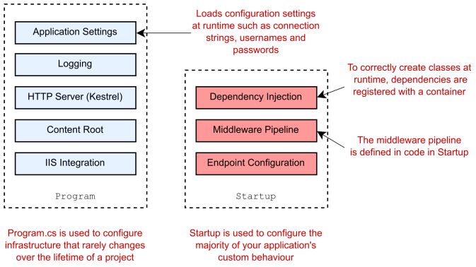
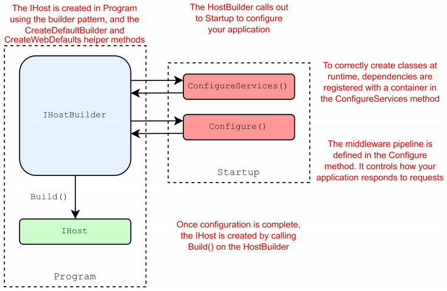

Chapter 11-Configuration
==============================

An ***host*** is an object that encapsulates an app's resources, such as:
<ul>
  <li>Dependency injection (DI)</li>
  <li>Logging</li>
  <li>Configuration</li>
  <li>IHostedService implementations</li>
</ul> 




some source code:
```C#
public class Program {
   public static void Main(string[] args) {
      CreateHostBuilder(args).Build().Run();
   }

   public static IHostBuilder CreateHostBuilder(string[] args) => {
      Host.CreateDefaultBuilder(args).
          .ConfigureWebHostDefaults(webBuilder => {
              webBuilder.UseStartup<Startup>();
          });
   });
}

public static class GenericHostBuilderExtensions {
   public static IHostBuilder ConfigureWebHostDefaults(this IHostBuilder builder, Action<IWebHostBuilder> configure) {
      return builder.ConfigureWebHost(webHostBuilder => {
            WebHost.ConfigureWebDefaults(webHostBuilder);
            configure(webHostBuilder);
      });
   }
}

public static class WebHost {
   ...
   internal static void ConfigureWebDefaults(IWebHostBuilder builder) {
      builder.ConfigureAppConfiguration((ctx, cb) => {
         if (ctx.HostingEnvironment.IsDevelopment()) {
            StaticWebAssetsLoader.UseStaticWebAssets(ctx.HostingEnvironment, ctx.Configuration);
         }
      });

      builder.UseKestrel((builderContext, options) => {
         options.Configure(builderContext.Configuration.GetSection("Kestrel"), reloadOnChange: true);
      })
      .ConfigureServices((hostingContext, services) => {
          ...
          services.AddTransient<IStartupFilter, HostFilteringStartupFilter>();
          services.AddTransient<IStartupFilter, ForwardedHeadersStartupFilter>();
          services.AddTransient<IConfigureOptions<ForwardedHeadersOptions>, ForwardedHeadersOptionsSetup>();
          services.AddRouting();   // register routing related services e.g. LinkGenerator, so you don't need to add them or call AddRouting() in Startup.cs
      }
      .UseIIS()
      .UseIISIntegration();
   }
}
```
```C#
public static class Host {

   public static IHostBuilder CreateDefaultBuilder() => CreateDefaultBuilder(args: null);

   public static IHostBuilder CreateDefaultBuilder(string[] args) {   // initializes a new instance of HostBuilder class with pre-configured defaults
      var builder = new HostBuilder();

      builder.UseContentRoot(Directory.GetCurrentDirectory());   // specify the content root directory to be used by the host.

      builder.ConfigureHostConfiguration(config => {             // config is IConfigurationBuilder
         config.AddEnvironmentVariables(prefix: "DOTNET_");
         if (args != null) {
            config.AddCommandLine(args);
         }
      });
      // ------------------Configures application settings, the is the main topic of this chapter----------------------------------------------
      builder.ConfigureAppConfiguration((hostingContext, config) => {   // hostingContext is HostBuilderContext, config is IConfigurationBuilder
          IHostEnvironment env = hostingContext.HostingEnvironment;
          bool reloadOnChange = hostingContext.Configuration.GetValue("hostBuilder:reloadConfigOnChange", defaultValue: true);

          config.AddJsonFile("appsettings.json", optional: true, reloadOnChange: reloadOnChange)   // You can see that appsettings.json will always be used
                .AddJsonFile($"appsettings.{env.EnvironmentName}.json", optional: true, reloadOnChange: reloadOnChange);

          if (env.IsDevelopment() && !string.IsNullOrEmpty(env.ApplicationName)) {
             var appAssembly = Assembly.Load(new AssemblyName(env.ApplicationName));
             if (appAssembly != null) {
                config.AddUserSecrets(appAssembly, optional: true);   // asp.net core app uses secerets by default
             }
          }

          config.AddEnvironmentVariables();

          if (args != null) {
             config.AddCommandLine(args);
          }
      });
      // ----------------------------------------------------------------------------------------------------------------------------------------
      builder.ConfigureLogging((hostingContext, logging) => {
         logging.AddConfiguration(hostingContext.Configuration.GetSection("Logging"));
         logging.AddConsole();
         logging.AddDebug();
      });

      // Configures the DI container
      builder.UseDefaultServiceProvider((context, options) => {
         var isDevelopment = context.HostingEnvironment.IsDevelopment();
         options.ValidateScopes = isDevelopment;
         options.ValidateOnBuild = isDevelopment;
      });

      return builder;
   }
}
//------------------------------------------------------------------------------------------------------------------------------
public interface IHostBuilder {
   IDictionary<object, object> Properties { get; }

   IHostBuilder ConfigureAppConfiguration(Action<HostBuilderContext, IConfigurationBuilder> configureDelegate);
   IHostBuilder ConfigureContainer<TContainerBuilder>(Action<HostBuilderContext, TContainerBuilder> configureDelegate);
   IHostBuilder ConfigureHostConfiguration(Action<IConfigurationBuilder> configureDelegate);
   IHostBuilder ConfigureServices(Action<HostBuilderContext, IServiceCollection> configureDelegate);
   IHostBuilder UseServiceProviderFactory<TContainerBuilder>(IServiceProviderFactory<TContainerBuilder> factory);
   IHostBuilder UseServiceProviderFactory<TContainerBuilder>(Func<HostBuilderContext, IServiceProviderFactory<TContainerBuilder>> factory);

   IHost Build();
}

public static class HostingHostBuilderExtensions {
   ...
   public static IHostBuilder UseContentRoot(this IHostBuilder hostBuilder, string contentRoot) {
      return hostBuilder.ConfigureHostConfiguration(configBuilder => {
         configBuilder.AddInMemoryCollection(new[] {
            new KeyValuePair<string, string>(HostDefaults.ContentRootKey,
            contentRoot  ?? throw new ArgumentNullException(nameof(contentRoot)))
         });
      });
   }
   
   // specify the IServiceProvider to be the default one
   public static IHostBuilder UseDefaultServiceProvider(this IHostBuilder hostBuilder, Action<HostBuilderContext, ServiceProviderOptions> configure) {
      return hostBuilder.UseServiceProviderFactory(context => {
         var options = new ServiceProviderOptions();
         configure(context, options);
         return new DefaultServiceProviderFactory(options);
      });
   }

   public static IHostBuilder ConfigureLogging(this IHostBuilder hostBuilder, Action<ILoggingBuilder> configureLogging) {
      return hostBuilder.ConfigureServices((context, collection) => collection.AddLogging(builder => configureLogging(builder)));
   }
}

public class HostBuilder : IHostBuilder {
   private List<Action<IConfigurationBuilder>> _configureHostConfigActions = new List<Action<IConfigurationBuilder>>();
   private List<Action<HostBuilderContext, IConfigurationBuilder>> _configureAppConfigActions = new List<Action<HostBuilderContext, IConfigurationBuilder>>();
   private List<Action<HostBuilderContext, IServiceCollection>> _configureServicesActions = new List<Action<HostBuilderContext, IServiceCollection>>();
   private List<IConfigureContainerAdapter> _configureContainerActions = new List<IConfigureContainerAdapter>();
   private IServiceFactoryAdapter _serviceProviderFactory = new ServiceFactoryAdapter<IServiceCollection>(new DefaultServiceProviderFactory());
   private bool _hostBuilt;
   private IConfiguration _hostConfiguration;
   private IConfiguration _appConfiguration;   // will hold all the configuration key values eventually
   private HostBuilderContext _hostBuilderContext;
   private IHostingEnvironment _hostingEnvironment;
   private IServiceProvider _appServices;

   public IDictionary<object, object> Properties { get; } = new Dictionary<object, object>();

   public IHostBuilder ConfigureHostConfiguration(Action<IConfigurationBuilder> configureDelegate) {
      _configureHostConfigActions.Add(configureDelegate ?? throw new ArgumentNullException(nameof(configureDelegate)));
      return this;
   }

   public IHostBuilder ConfigureAppConfiguration(Action<HostBuilderContext, IConfigurationBuilder> configureDelegate) {
      _configureAppConfigActions.Add(configureDelegate ?? throw new ArgumentNullException(nameof(configureDelegate)));
      return this;
   }

   public IHostBuilder ConfigureServices(Action<HostBuilderContext, IServiceCollection> configureDelegate) {
      _configureServicesActions.Add(configureDelegate ?? throw new ArgumentNullException(nameof(configureDelegate)));
      return this;
   }

   // overrides the factory used to create the service provider
   public IHostBuilder UseServiceProviderFactory<TContainerBuilder>(IServiceProviderFactory<TContainerBuilder> factory) {
       _serviceProviderFactory = new ServiceFactoryAdapter<TContainerBuilder>(factory ?? throw new ArgumentNullException(nameof(factory)));
       return this;
   }
   ...
   public IHost Build() {
      if (_hostBuilt) {
         throw new InvalidOperationException("Build can only be called once.");
      }
      _hostBuilt = true;

      BuildHostConfiguration();     // add environment related providers to ConfigurationBuilder
      CreateHostingEnvironment();   // provide HostingEnvironment that tells the app the environment e.g "Development"
      CreateHostBuilderContext();   // provide HostBuilderContext for BuildAppConfiguration as the first paramater to execute the delegate
      BuildAppConfiguration();
      CreateServiceProvider();

      return _appServices.GetRequiredService<IHost>();
   }

   private void BuildHostConfiguration() {
      var configBuilder = new ConfigurationBuilder();
      foreach (var buildAction in _configureHostConfigActions) {
         buildAction(configBuilder);
      }
      _hostConfiguration = configBuilder.Build();
   }

   private void CreateHostingEnvironment() {
      _hostingEnvironment = new HostingEnvironment() {
         ApplicationName = _hostConfiguration[HostDefaults.ApplicationKey],
         EnvironmentName = _hostConfiguration[HostDefaults.EnvironmentKey] ?? EnvironmentName.Production,
         ContentRootPath = ResolveContentRootPath(_hostConfiguration[HostDefaults.ContentRootKey], AppContext.BaseDirectory),
      }
      _hostingEnvironment.ContentRootFileProvider = new PhysicalFileProvider(_hostingEnvironment.ContentRootPath);
   }

   private void CreateHostBuilderContext() {
      _hostBuilderContext = new HostBuilderContext(Properties) {
         HostingEnvironment = _hostingEnvironment,
         Configuration = _hostConfiguration
      }
   }

   private void BuildAppConfiguration() {
      var configBuilder = new ConfigurationBuilder();
      configBuilder.AddConfiguration(_hostConfiguration);
      foreach (var buildAction in _configureAppConfigActions) {
         buildAction(_hostBuilderContext, configBuilder);
      }
      _appConfiguration = configBuilder.Build();   // _appConfiguration is ConfigurationRoot, and note that IConfigurationRoot : IConfiguration
      _hostBuilderContext.Configuration = _appConfiguration;
   }

   private void CreateServiceProvider() {
      var services = new ServiceCollection();
      services.AddSingleton(_hostingEnvironment);
      services.AddSingleton(_hostBuilderContext);
      services.AddSingleton(_appConfiguration); // register ConfigurationRoot as IConfiguration
                                                // _appConfiguration is ConfigurationRoot but declared as IConfiguration
      services.AddSingleton<IApplicationLifetime, ApplicationLifetime>();
      services.AddSingleton<IHostLifetime, ConsoleLifetime>();
      services.AddSingleton<IHost, Host>();
      services.AddOptions();
      services.AddLogging();

      foreach (var configureServicesAction in _configureServicesActions) {
         configureServicesAction(_hostBuilderContext, services);
      }

      var containerBuilder = _serviceProviderFactory.CreateBuilder(services);   // containerBuilder is ServiceCollection

      foreach (var containerAction in _configureContainerActions) {
         containerAction.ConfigureContainer(_hostBuilderContext, containerBuilder);
      }

      _appServices = _serviceProviderFactory.CreateServiceProvider(containerBuilder);   // it registers IServiceProvider internally (in ServiceProviderEngine)
                                                                                        // this is why we can inject IServiceProvider (root scope) into our services
   }
   ...
}

public class DefaultServiceProviderFactory : IServiceProviderFactory<IServiceCollection> {
   private readonly ServiceProviderOptions _options;

   public DefaultServiceProviderFactory() : this(ServiceProviderOptions.Default) { }
   ...

   public IServiceCollection CreateBuilder(IServiceCollection services) {
      return services;
   }

   public IServiceProvider CreateServiceProvider(IServiceCollection containerBuilder) {
      return containerBuilder.BuildServiceProvider(_options);
   }
}

public class HostBuilderContext {
   public HostBuilderContext(IDictionary<object, object> properties);
   public IConfiguration Configuration { get; set; }
   public IHostEnvironment HostingEnvironment { get; set; }
   public IDictionary<object, object> Properties { get; }
}
//---------------------------------------------------------------------------------------------------------------------------------------
public static class JsonConfigurationExtensions {
   public static IConfigurationBuilder AddJsonFile(this IConfigurationBuilder builder, string path) {
      return AddJsonFile(builder, provider: null, path: path, optional: false, reloadOnChange: false);
   }
   ...
   public static IConfigurationBuilder AddJsonFile(this IConfigurationBuilder builder, IFileProvider provider, string path, bool optional, bool reloadOnChange) {
      return builder.AddJsonFile(s => {   // s is JsonConfigurationSource
         s.FileProvider = provider;
         s.Path = path;
         s.Optional = optional;
         s.ReloadOnChange = reloadOnChange;
         s.ResolveFileProvider();
      });
   }
   public static IConfigurationBuilder AddJsonFile(this IConfigurationBuilder builder, Action<JsonConfigurationSource> configureSource) {
      builder.Add(configureSource);
   }
}

/*------------------------------------------------------------*/

public interface IConfigurationBuilder {
   IDictionary<string, object> Properties { get; }
   IList<IConfigurationSource> Sources { get; }
   IConfigurationBuilder Add(IConfigurationSource source);
   IConfigurationRoot Build();
}

public class ConfigurationBuilder : IConfigurationBuilder {
    public IList<IConfigurationSource> Sources { get; } = new List<IConfigurationSource>();

    public IDictionary<string, object> Properties { get; } = new Dictionary<string, object>();

    public IConfigurationBuilder Add(IConfigurationSource source) {
       if (source == null) {
          throw new ArgumentNullException(nameof(source));
       }
       Sources.Add(source);
       return this;
    }

    public IConfigurationRoot Build() {
       var providers = new List<IConfigurationProvider>();
       foreach (var source in Sources) {
          var provider = source.Build(this);
          providers.Add(provider);
       }
       return new ConfigurationRoot(providers);
    }
}

public interface IConfigurationSource {
   IConfigurationProvider Build(IConfigurationBuilder builder);
}

public class EnvironmentVariablesConfigurationSource : IConfigurationSource {
   public string Prefix { get; set; }

   public IConfigurationProvider Build(IConfigurationBuilder builder) {
      return new EnvironmentVariablesConfigurationProvider(Prefix);
   }
}

//----------------------------------------------------------------------------------------------------
public static class EnvironmentVariablesExtensions {
   ...
   public static IConfigurationBuilder AddEnvironmentVariables(this IConfigurationBuilder configurationBuilder) {
      configurationBuilder.Add(new EnvironmentVariablesConfigurationSource());
      return configurationBuilder;
   }

   public static IConfigurationBuilder AddEnvironmentVariables( this IConfigurationBuilder configurationBuilder, string prefix) {
      configurationBuilder.Add(new EnvironmentVariablesConfigurationSource { Prefix = prefix });
      return configurationBuilder;
   }

   public static IConfigurationBuilder AddEnvironmentVariables(this IConfigurationBuilder builder, Action<EnvironmentVariablesConfigurationSource> configureSource) => builder.Add(configureSource);
}

public interface IConfigurationSource {
   IConfigurationProvider Build(IConfigurationBuilder builder);
}

public class EnvironmentVariablesConfigurationSource : IConfigurationSource {
   public string Prefix { get; set; }

   public IConfigurationProvider Build(IConfigurationBuilder builder) {
      return new EnvironmentVariablesConfigurationProvider(Prefix);
   }
}

public class EnvironmentVariablesConfigurationProvider : ConfigurationProvider {
   private const string MySqlServerPrefix = "MYSQLCONNSTR_";
   private const string SqlAzureServerPrefix = "SQLAZURECONNSTR_";
   ...
   public override void Load() {
      Load(Environment.GetEnvironmentVariables());
   }

   internal void Load(IDictionary envVariables) {
      Data = new Dictionary<string, string>(StringComparer.OrdinalIgnoreCase);
      
      var filteredEnvVariables = envVariables.Cast<DictionaryEntry>().SelectMany(AzureEnvToAppEnv).Where(entry => ((string)entry.Key).StartsWith(_prefix, StringComparison.OrdinalIgnoreCase));

      foreach (var envVariable in filteredEnvVariables) {
         var key = ((string)envVariable.Key).Substring(_prefix.Length);
         Data[key] = (string)envVariable.Value;
      }
   }
   ...
}
/*--------------------------------------------------------------------------------------------------------*/

public interface IConfigurationProvider {
   IEnumerable<string> GetChildKeys(IEnumerable<string> earlierKeys, string parentPath);
   IChangeToken GetReloadToken();
   void Load();
   void Set(string key, string value);
   bool TryGet(string key, out string value);
}

public abstract class ConfigurationProvider : IConfigurationProvider {
   private ConfigurationReloadToken _reloadToken = new ConfigurationReloadToken();
   protected IDictionary<string, string> Data { get; set; }

   protected ConfigurationProvider() {
      Data = new Dictionary<string, string>(StringComparer.OrdinalIgnoreCase);
   }

   public virtual bool TryGet(string key, out string value) => Data.TryGetValue(key, out value);

   public virtual void Set(string key, string value) => Data[key] = value;

   public virtual void Load() { }

   public virtual IEnumerable<string> GetChildKeys(IEnumerable<string> earlierKeys, string parentPath) {
      var prefix = parentPath == null ? string.Empty : parentPath + ConfigurationPath.KeyDelimiter;

      return Data.Where(kv => kv.Key.StartsWith(prefix, StringComparison.OrdinalIgnoreCase))
                 .Select(kv => Segment(kv.Key, prefix.Length))
                 .Concat(earlierKeys)
                 .OrderBy(k => k, ConfigurationKeyComparer.Instance);
   }

   private static string Segment(string key, int prefixLength) {
      var indexOf = key.IndexOf(ConfigurationPath.KeyDelimiter, prefixLength, StringComparison.OrdinalIgnoreCase);
      return indexOf < 0 ? key.Substring(prefixLength) : key.Substring(prefixLength, indexOf - prefixLength);
   }

   public IChangeToken GetReloadToken() {
      return _reloadToken;
   }

   protected void OnReload() {
      var previousToken = Interlocked.Exchange(ref _reloadToken, new ConfigurationReloadToken());
      previousToken.OnReload();
   }
}

public class EnvironmentVariablesConfigurationProvider : ConfigurationProvider {
   private const string MySqlServerPrefix = "MYSQLCONNSTR_";
   private const string SqlAzureServerPrefix = "SQLAZURECONNSTR_";
   private const string SqlServerPrefix = "SQLCONNSTR_";
   private const string CustomPrefix = "CUSTOMCONNSTR_";

   private const string ConnStrKeyFormat = "ConnectionStrings:{0}";
   private const string ProviderKeyFormat = "ConnectionStrings:{0}_ProviderName";

   private readonly string _prefix;

   public EnvironmentVariablesConfigurationProvider() : this(string.Empty) { }

   public EnvironmentVariablesConfigurationProvider(string prefix) {
      _prefix = prefix ?? string.Empty;
   }

   public override void Load() {
      Load(Environment.GetEnvironmentVariables());
   }

   internal void Load(IDictionary envVariables) {
      Data = new Dictionary<string, string>(StringComparer.OrdinalIgnoreCase);
      
      var filteredEnvVariables = envVariables.Cast<DictionaryEntry>().SelectMany(AzureEnvToAppEnv).Where(entry => ((string)entry.Key).StartsWith(_prefix, StringComparison.OrdinalIgnoreCase));

      foreach (var envVariable in filteredEnvVariables) {
         var key = ((string)envVariable.Key).Substring(_prefix.Length);
         Data[key] = (string)envVariable.Value;
      }
   }

   private static string NormalizeKey(string key) {
      return key.Replace("__", ConfigurationPath.KeyDelimiter);   // KeyDelimiter is ":"
   }

   private static IEnumerable<DictionaryEntry> AzureEnvToAppEnv(DictionaryEntry entry) {
      var key = (string)entry.Key;
      var prefix = string.Empty;
      var provider = string.Empty;

      if (key.StartsWith(MySqlServerPrefix, StringComparison.OrdinalIgnoreCase)) {
         prefix = MySqlServerPrefix;
         provider = "MySql.Data.MySqlClient";
      } else if (key.StartsWith(SqlAzureServerPrefix, StringComparison.OrdinalIgnoreCase)) {
         prefix = SqlAzureServerPrefix;
         provider = "System.Data.SqlClient";
      } else if (key.StartsWith(SqlServerPrefix, StringComparison.OrdinalIgnoreCase)) {
         prefix = SqlServerPrefix;
         provider = "System.Data.SqlClient";
      ...
   }
}
//-----------------------------------------------------------------------------------------------------------
public interface IConfiguration {   // namespace Microsoft.Extensions.Configuration; Assembly Microsoft.Extensions.Configuration.Abstractions
   string this[string key] { get; set; }
   IConfigurationSection GetSection(string key);
   ...
}

public interface IConfigurationRoot : IConfiguration {
   IEnumerable<IConfigurationProvider> Providers { get; }
   void Reload();
}

public class ConfigurationRoot : IConfigurationRoot {
   private IList<IConfigurationProvider> _providers;
   private ConfigurationReloadToken _changeToken = new ConfigurationReloadToken();

   public ConfigurationRoot(IList<IConfigurationProvider> providers) {
      _providers = providers;
      foreach (var p in providers) {
         p.Load();
         ChangeToken.OnChange(() => p.GetReloadToken(), () => RaiseChanged());
      }
   }

   public IEnumerable<IConfigurationProvider> Providers => _providers;

   public string this[string key] {
      get {
         foreach (var provider in _providers.Reverse()) {
            string value;
            if (provider.TryGet(key, out value)) {
               return value;
            }
         }
         return null;
      }

      set {
         foreach (var provider in _providers) {
            provider.Set(key, value);
         }
      }
   }

   public IConfigurationSection GetSection(string key) => new ConfigurationSection(this, key);

   public IChangeToken GetReloadToken() => _changeToken;

   public IEnumerable<IConfigurationSection> GetChildren() => GetChildrenImplementation(null);

   internal IEnumerable<IConfigurationSection> GetChildrenImplementation(string path) {
      return _providers.Aggregate(Enumerable.Empty<string>(), seed, source) => source.GetChildKeys(seed, path))
                       .Distinct()
                       .Select(key => GetSection(path == null ? key : ConfigurationPath.Combine(path, key)));
   }

   public void Reload() {
      foreach (var provider in _providers) {
         provider.Load();
      }
   }

   private void RaiseChanged() {
      var previousToken = Interlocked.Exchange(ref _changeToken, new ConfigurationReloadToken());
      previousToken.OnReload();
   }
}
//-------------------------------------------------------------------------------------------------------------------
/*
public interface IConfiguration {
   string this[string key] { get; set; }
   IConfigurationSection GetSection(string key);
   ...
}
*/
public interface IConfigurationSection : IConfiguration {
   string Key { get; }
   string Path { get; }
   string Value { get; set; }
}

public class ConfigurationSection : IConfigurationSection {
   private readonly ConfigurationRoot _root;
   private readonly string _path;
   private string _key;

   public ConfigurationSection(ConfigurationRoot root, string path) {
      _root = root;
      _path = path;
   }

   public string Path => _path;

   public string Key {
      get {
         if (_key == null) {
            // Key is calculated lazily as last portion of Path
             _key = ConfigurationPath.GetSectionKey(_path);
         }
         return _key;
      }
   }

   public string Value {
      get {
         return _root[Path];
      }
      set {
         _root[Path] = value;
      }
   }

   public string this[string key] {
      get {
         return _root[ConfigurationPath.Combine(Path, key)];
      }
      set {
         _root[ConfigurationPath.Combine(Path, key)] = value;
      }
   }

    public IConfigurationSection GetSection(string key) => _root.GetSection(ConfigurationPath.Combine(Path, key));

    public IEnumerable<IConfigurationSection> GetChildren() => _root.GetChildrenImplementation(Path);

    public IChangeToken GetReloadToken() => _root.GetReloadToken();
}

public static class ConfigurationPath {
   public static readonly string KeyDelimiter = ":";

   public static string Combine(params string[] pathSegments) {
      return string.Join(KeyDelimiter, pathSegments);
   }

   public static string Combine(IEnumerable<string> pathSegments) {
      return string.Join(KeyDelimiter, pathSegments);
   }

   public static string GetSectionKey(string path) {
      if (string.IsNullOrEmpty(path)) {
         return path;
      }
      var lastDelimiterIndex = path.LastIndexOf(KeyDelimiter, StringComparison.OrdinalIgnoreCase);
      return lastDelimiterIndex == -1 ? path : path.Substring(lastDelimiterIndex + 1);
   }

   public static string GetParentPath(string path) {
      if (string.IsNullOrEmpty(path)) {
         return null;
      }
      var lastDelimiterIndex = path.LastIndexOf(KeyDelimiter, StringComparison.OrdinalIgnoreCase);
      return lastDelimiterIndex == -1 ? null : path.Substring(0, lastDelimiterIndex);
   }
}
```
## Demystifying ASP.NET Core Configuration

A very useful resource https://www.paraesthesia.com/archive/2018/06/20/microsoft-extensions-configuration-deep-dive/

```C#
public class Program {
   public static void Main(string[] args) {
      CreateHostBuilder(args).Build().Run();
   }

   public static IHostBuilder CreateHostBuilder(string[] args) =>
       Host.CreateDefaultBuilder(args)
           .ConfigureWebHostDefaults(webBuilder => {
              webBuilder.UseStartup<Startup>();
           });
}
```
Look at the source code of `Host.CreateDefaultBuilder(args)`:

```C#
public class HostBuilder : IHostBuilder {
   private IConfiguration _appConfiguration;
   ...
   private IConfiguration _appConfiguration; 
   ...
   private void BuildAppConfiguration() {
      var configBuilder = new ConfigurationBuilder();
      ...
      _appConfiguration = configBuilder.Build();
   }

   private void CreateServiceProvider() {
      ...
      services.AddSingleton(_appConfiguration); // it register IConfiguration to use `ConfigurationRoot`
   }
}
```
Note that `IConfiguration` is actually `ConfigurationRoot`(which implements `IConfigurationRoot`) instance, because `IConfigurationRoot` inherits `IConfiguration`, that's why sometimes you can register in this way :
```C#
// startup.cs
//services.AddSingleton<IConfigurationRoot>(Configuration);

public class HomeController : Controller {
   private IConfigurationRoot Configuration { get; }

   public HomeController(IConfigurationRoot config) {
      Configuration = config;
   }
   ...
}
```
Let's look at the `ConfigurationBuilder` class:


`ConfigurationBuilder` has a `Source` property which is `IList<IConfigurationSource>`,  when you calls AddXXX extension method, an `IConfigurationSource` is added to the list.

If you look at the structure of ConfigurationSource and ConfigurationProvider from a concrete example:
```C#
public interface IConfigurationSource {
   IConfigurationProvider Build(IConfigurationBuilder builder);
}

public class EnvironmentVariablesConfigurationSource : IConfigurationSource {
   public string Prefix { get; set; }

   public IConfigurationProvider Build(IConfigurationBuilder builder) {
      return new EnvironmentVariablesConfigurationProvider(Prefix);
   }
}

public class EnvironmentVariablesConfigurationProvider : ConfigurationProvider {   // ConfigurationProvider is an abstract class which implements IConfigurationProvider
   private const string MySqlServerPrefix = "MYSQLCONNSTR_";
   private const string SqlAzureServerPrefix = "SQLAZURECONNSTR_";
   ...
   public override void Load() {
      Load(Environment.GetEnvironmentVariables());
   }

   internal void Load(IDictionary envVariables) {
      Data = new Dictionary<string, string>(StringComparer.OrdinalIgnoreCase);
      ...
      foreach (var envVariable in filteredEnvVariables) {
         var key = ((string)envVariable.Key).Substring(_prefix.Length);
         Data[key] = (string)envVariable.Value;
      }
   }
   ...
}
```
You might ask why we need an extra layer of ConfigurationSource which returns a concrete provider in its Build method? Why not just get rid of `IConfigurationSource` and return a concrete ConfigurationProvider directly? 
The reason that we use `IConfigurationSource` is to have granular control on a provider. Image a scenario that you don't want to load all environment variable:
```
set RANDOM_VALUE=BlipBlipBlip   // you don't this one
set COMPONENTS__DATABASE__CONNECTION=connection-string
set COMPONENTS__FILES__PATH=/etc/path
set LOGGING__ENABLED=True
set LOGGING__LEVEL=Debug  
```
But if you added all the environment variables like this:
```C#
var config = new ConfigurationBuilder()
    .AddEnvironmentVariables()
    .Build();
```
You’d get everything, even maybe stuff you don't want:
```
components:database:connection = "connection-string"
components:files:path = "/etc/path"
logging:enabled = "True"
logging:level = "Debug"
random_value = "BlipBlipBlip"
```
Uh oh, that random_value snuck in. Instead, let's prefix the variables we like:
```
set RANDOM_VALUE=BlipBlipBlip
set CONFIGURATION_COMPONENTS__DATABASE__CONNECTION=connection-string
set CONFIGURATION_COMPONENTS__FILES__PATH=/etc/path
set CONFIGURATION_LOGGING__ENABLED=True
set CONFIGURATION_LOGGING__LEVEL=Debug
```
Now specify a prefix in the configuration build:
```C#
var config = new ConfigurationBuilder()
    .AddEnvironmentVariables("CONFIGURATION_")
    .Build();
```
That's how ConfigurationSource kicks in:
```C#
public class EnvironmentVariablesConfigurationSource : IConfigurationSource {
   public string Prefix { get; set; }

   public IConfigurationProvider Build(IConfigurationBuilder builder) {
      return new EnvironmentVariablesConfigurationProvider(Prefix);
   }
}

public class EnvironmentVariablesConfigurationProvider : ConfigurationProvider {
   ...
   private readonly string _prefix;

   public EnvironmentVariablesConfigurationProvider(string prefix) {
      _prefix = prefix ?? string.Empty;
   }
}
```
Note that prefix gets trimmed off and the correct environment variables make it in:
```
components:database:connection = "connection-string"
components:files:path = "/etc/path"
logging:enabled = "True"
logging:level = "Debug"
```

Let's go back to `ConfigurationBuilder.Build()`, now we have a list of providers ready, the `Build()` method returns an instance of ` ConfigurationRoot`


Now you see that what you inject and uses `IConfiguration`, you are using ConfigurationRoot that contains a list of providers. When you ask an IConfigurationRoot for a configuration item, it iterates through the set of providers (in reverse order - that's how the "override" works) until it finds the value, then returns the first value found. If no value is found, it returns null.
Only file-based providers handle reloading on change events.  Usually this is either because there's not a reasonable way to receive a change event; or it doesn't make sense that the values would change during runtime:

<ul>
  <li>Azure Key Vault</li>
  <li>Command Line</li>
  <li>Environment Variables</li>
  <li>User Secrets (the underlying provider here is JSON files but the code specifically turns off the reload on change flag)</li>
</ul> 

So in these cases, you can manually call `Reload` method of `ConfigurationRoot`.

From the `IConfigurationRoot` you can ask directly for a key like `["logging:level"]` or you can call `GetSection` method to get an `IConfigurationSection`


Every `ConfigurationSection` wraps the same `ConfigurationRoot` and uses this root to search for key/value, you don't need to spend too much time to fully understand the code, let's look at some example and you will get the idea:
```json
// appsettings.json
{
  "debug": true,
  "logging": {
    "includeScopes": false,
    "logLevel": {
      "default": "Debug"
    }
  }
}

// overrides.json
{
  "logging": {
    "logLevel": {
      "default": "Warning"
    }
  }
}

// The flattened configuration will look like:
debug = "True"
logging:includescopes = "False"
logging:loglevel:default = "Warning"
```
Let's build the configuration and wander around:
```C#
var builder = new ConfigurationBuilder();

builder.AddJsonFile("appsettings.json")
       .AddJsonFile("overrides.json");

IConfigurationRoot configRoot = builder.Build();  

string includeScopes = configRoot["logging:includescopes"]   // includeScopes is False

var loggingSection = configRoot.GetSection("logging");

string loggingDefaultV1 = configRoot["logging:loglevel:default"] 
string loggingDefaultV2 = loggingSection["loglevel:default"]   // no need to include "logging" anymore
```

----------------------------------------------------------------------------------------------------------------------
## Demystifying IOptions Pattern

```json
{
   "SlackApi": {
      "WebhookUrl": "https://hooks.slack.com/T1/B1/111111",
      "DisplayName": "c0mp4ny 5l4ck b007"
   }
}
```
```C#
public class SlackApiSettings  
{
    public string WebhookUrl { get; set; }
    public string DisplayName { get; set; }
}

// startup.cs
public class Startup {
   ...
   public void ConfigureServices(IServiceCollection services) {
      services.Configure<SlackApiSettings>(Configuration.GetSection("SlackApi"));  
   }
}

public class SlackNotificationService
{
    private readonly SlackApiSettings _settings;
    public SlackNotificationService(IOptions<SlackApiSettings> options)
    {
        _settings = options.Value
    }
    
    public void SendNotification(string message) {
        // use the settings to send a message
    }
}
```

You could also "setup" (when there is no json config)  option on the fly as:
```C#
public class Startup {
   ...
   public void ConfigureServices(IServiceCollection services) {
      services.Configure<SlackApiSettings>(opts => {   // <--------------------------------------C
         opts.WebhookUrl = "https://other.com";
         opts.DisplayName = "Other";
      });  
   }
}
```
Behind the scene, a new `SlackApiSettings` instance will be created (not via reflection, just simplie `new TOptions()`, see c1), then somehow asp.net core will apply the `Action<TOptions>` on this instance, see c2.2.

You will see this pattern in a lot of places, especially in middlewares, for example:
```C#
public class Startup {
   
   public void ConfigureServices(IServiceCollection services) {
      services.Configure<CookiePolicyOptions>(opts => {   // registe IOptions<CookiePolicyOptions>
         opts.CheckConsentNeeded = context => true;
      });  
   }

   public void Configure(IApplicationBuilder app) {
      app.UseDeveloperExceptionPage();
      app.UseCookiePolicy();  // <--------------------
      app.UseRouting();
      // ...
   }
}

public static class CookiePolicyAppBuilderExtensions {
   
   public static IApplicationBuilder UseCookiePolicy(this IApplicationBuilder app) {
      return app.UseMiddleware<CookiePolicyMiddleware>();   // use MSDI to inject IOptions<CookiePolicyOptions>
   }

   public static IApplicationBuilder UseCookiePolicy(this IApplicationBuilder app, CookiePolicyOptions options) {
      return app.UseMiddleware<CookiePolicyMiddleware>(Options.Create(options));  // manually create new OptionsWrapper<TOptions>(options)
   }
}

public class CookiePolicyMiddleware {
   private readonly RequestDelegate _next;
   private readonly ILogger _logger;

   public CookiePolicyMiddleware(RequestDelegate next, IOptions<CookiePolicyOptions> options, ILoggerFactory factory) {
      Options = options.Value;
      _next = next;
      _logger = factory.CreateLogger<CookiePolicyMiddleware>();
   }

   public CookiePolicyOptions Options { get; set; }

   public Task Invoke(HttpContext context) {
      // ...
   }
}
```
The key take away is, the purpose of callling `services.Configure<XXXOptions>(opts => { ... });` are:

1. Register `IOptions<XXXOptions>` as singleton so it can be injected (most of times, injected into middleware's constructor)

2. Since `IOptions<XXXOptions>` is registered as singleton, if you check the source code, you will see an instance of XXXOptions is created first (`new TOptions()` in c1), then
the action delegate applies on this instance (c2.2)


Another common pattern to register `IOptions<XXXOptions>` is via extension method:

```C#
public class Startup {
   // ...
   public void ConfigureServices(IServiceCollection services) {
      
      services.Configure<CookiePolicyOptions>(opts => { 
         opts.CheckConsentNeeded = context => true;
      });

      services.AddHttpsRedirection(opts => {   // use extension method to register
         opts.RedirectStatusCode = StatusCodes.Status307TemporaryRedirect;
         opts.HttpsPort = 443;
      });
   }
}

public static class HttpsRedirectionServicesExtensions {
   public static IServiceCollection AddHttpsRedirection(this IServiceCollection services, Action<HttpsRedirectionOptions> configureOptions) {
      services.Configure(configureOptions);
      return services;
   }
}
// it is interesting to note that some AddXXX extension methods's job is just to register XXXOptions
```


#### Handling configuration changes with IOptionsSnapshot<T>
------------------------------------------------------------
Using `IOptions<T>` for strongly typed configuration assumes that your configuration is fixed for the lifetime of the app. The configuration values are calculated and bound to your POCO objects once; if you later change your appsettings.json file for example, the changes won't show up in your app. However, if you do need to support reloading of configuration, you can do so with the `IOptionsSnapshot<T>` interface. This interface is configured at the same time as the `IOptions<T>` interface ( in `AddOptions` extension method), so you don't have to do anything extra to use it in your apps:
```C#
public class SlackNotificationService {
    private readonly SlackApiSettings _settings;
    public SlackNotificationService(IOptionsSnapshot<SlackApiSettings> options) {
       _settings = options.Value
    }
}
```
If you later change the value of your configuration, e.g. by editing your appsettings.json file, the `IOptionsSnapshot<T>` will update the strongly typed configuration on the next request, and you'll see the new values. Note that the configuration values essentially have a "Scoped" lifetime - you'll see the same configuration values in `IOptionsSnapshot<T>` for the lifetime of the request.

#### Using multiple instances of a strongly-typed settings object

What if you wanted to update the SlackNotificationService to allow you to send messages to multiple channels. For example:
```C#
public class SlackNotificationService {
   public void SendNotificationToDevChannel(string message) { }
   public void SendNotificationToGeneralChannel(string message) { }
   public void SendNotificationToPublicChannel(string message) { }
}
```
```json
{
  "SlackApi": {
    "DevChannel" : {
      "WebhookUrl": "https://hooks.slack.com/T1/B1/111111",
      "DisplayName": "c0mp4ny 5l4ck b07"
    },
    "GeneralChannel" : {
      "WebhookUrl": "https://hooks.slack.com/T2/B2/222222",
      "DisplayName": "Company Slack Bot"
    },
    "PublicChannel" : {
      "WebhookUrl": "https://hooks.slack.com/T3/B3/333333",
      "DisplayName": "Professional Looking name"
    }
}
```
We have the following options:

1. Create a parent settings object

```C#
public class SlackApiSettings {
   public ChannelSettings DevChannel { get; set; }   // note that the property name needs to match the section name
   public ChannelSettings GeneralChannel { get; set; }
   public ChannelSettings PublicChannel { get; set; }

   public class ChannelSettings {
      public string WebhookUrl { get; set; }
      public string DisplayName { get; set; }
   }
}

// startup.cs
public void ConfigureServices(IServiceCollection services) {
   services.Configure<SlackApiSettings>(Configuration.GetSection("SlackApi")); 
}
```
The downside is that adding support for another channel involves editing the SlackApiSettings class, which may not be possible (or desirable) in some cases

2. Create separate classes for each channel

```C#
public abstract class ChannelSettings {
   public string WebhookUrl { get; set; }
   public string DisplayName { get; set; }
}

//startup.cs
public class DevChannelSettings: ChannelSettings { }
public class GeneralChannelSettings: ChannelSettings { }
public class PublicChannelSettings: ChannelSettings { }

public void ConfigureServices(IServiceCollection services) {
   services.Configure<DevChannelSettings>(Configuration.GetSection("SlackApi:DevChannel")); 
   services.Configure<GeneralChannelSettings>(Configuration.GetSection("SlackApi:GeneralChannel")); 
   services.Configure<PublicChannelSettings>(Configuration.GetSection("SlackApi:PublicChannel")); 
}

public class SlackNotificationService {
   private readonly DevChannelSettings _devSettings;
   private readonly GeneralChannelSettings _generalSettings;
   private readonly PublicChannelSettings _publicSettings;

   public SlackNotificationService(IOptions<DevChannelSettings> devOptions, IOptions<GeneralChannelSettings> generalOptions IOptions<PublicChannelSettings> publicOptions) {
        _devSettings = devOptions;
        _generalSettings = generalOptions;
        _publicSettings = publicOptions;
   }
   ...
}
```
The advantage of this approach is that it allows you to add extra ChannelSettings without editing existing classes. It also makes it possible to inject a subset of the channel settings if that's all that's required. However it also makes things rather more complex to configure and use, with each new channel requiring a new options object, a new call to `Configure()`, and modifying the constructor of the `SlackNotificationService`. 

3. Use named options (the best approach)
```C#
public class SlackApiSettings {
   public string WebhookUrl { get; set; }
   public string DisplayName { get; set; }
}

//startup.cs
public void ConfigureServices(IServiceCollection services) {
   services.Configure<SlackApiSettings>("Dev", Configuration.GetSection("SlackApi:DevChannel")); 
   services.Configure<SlackApiSettings>("General", Configuration.GetSection("SlackApi:GeneralChannel")); 
   services.Configure<SlackApiSettings>("Public", Configuration.GetSection("SlackApi:PublicChannel")); 
}
```
To use these named options. **you must inject `IOptionsSnapsShot<T>`, not `IOptions<T>`** into the SlackNotificationService. This gives you access to the IOptionsSnapshot<T>.Get(name) method, that you can use to retrieve the individual options:
```C#
public class SlackNotificationService {
   private readonly SlackApiSettings _devSettings;
   private readonly SlackApiSettings _generalSettings;
   private readonly SlackApiSettings _publicSettings;

   public SlackNotificationService(IOptionsSnapshot<SlackApiSettings> options) {
       _devSettings = options.Get("Dev");
       _generalSettings = options.Get("General");
       _publicSettings = options.Get("Public");
   }
}
```
The big advantage of this approach is that you don't need to create any new classes or methods to add a new channel, you just need to configure a new named SlackApiSettings options object. The constructor of SlackNotifictionService is untouched as well. On the disadvantage side, it's not clear from the SlackNotificationService constructor exactly which settings objects it's dependent on.

There is also `IOptionsMonitor` which has a slightly difference than `IOptionsSnapshot`. `IOptionsSnapshot` is a scoped service that responds to changes in every request, which means that if you change the config file the latest value will only be available via `IOptionsSnapshot` in the next request. However, `IOptionsMonitor` is a singleton service which can respond to changes in config file in real time (doesn't need to wait for the next request to retrieve latest value).

#### Using services during options configuration

Sometimes you need additional services to configure your strongly-typed settings. For example, imagine that configuring your MySettings class requires loading values from the database using EF Core, or performing some complex operation that is encapsulated in a CalculatorService. You can't access services you've registered in `ConfigureServices()`:
```C#
public void ConfigureServices(IServiceCollection services) {
   // register our helper service
   services.AddSingleton<CalculatorService>();

   // Want to set MySettings based on values from the CalculatorService
   services.Configure<MySettings>(settings => {  
        // No easy/safe way of accessing CalculatorService here!
   }); 
}
```
Instead of calling `Configure<MySettings>`, you can create a simple class to handle the configuration for you. This class should implement `IConfigureOptions<MySettings>` and can use dependency injection to inject dependencies that you registered in ConfigureServices:
```C#
public class ConfigureMySettingsOptions : IConfigureOptions<MySettings> {
   private readonly CalculatorService _calculator;
   public ConfigureMySettingsOptions(CalculatorService calculator) {
       _calculator = calculator;
   }

   public void Configure(MySettings options) {
      options.MyValue = _someService.DoComplexCalcaultion();
   }
}

// all that remains is to register the IConfigureOptions<> instance (and its dependencies) in Startup.cs:
public void ConfigureServices(IServiceCollection services) {
   services.Configure<MySettings>(Configuration.GetSection("MyConfig"));
    services.AddSingleton<CalculatorService>();
   services.AddSingleton<IConfigureOptions<MySettings>, ConfigureMySettingsOptions>();
}
```

#### Souce code of IOptions

```C#
public static class OptionsServiceCollectionExtensions {   // namespace Microsoft.Extensions.DependencyInjection
   ...
   public static IServiceCollection Configure<TOptions>(this IServiceCollection services, Action<TOptions> configureOptions) where TOptions : class {
      return services.Configure(Options.DefaultName, configureOptions);   // <-----------------c0
   }
   
   public static IServiceCollection Configure<TOptions>(this IServiceCollection services, string name, Action<TOptions> configureOptions) {
      services.AddOptions();
      services.AddSingleton<IConfigureOptions<TOptions>>(new ConfigureNamedOptions<TOptions>(name, configureOptions));  // <-----------------c0
      return services;
   }   // this method is often used in Option Pattern to overwrite default setting value, so the process is like DI create a singleton instance of      
       // IOptions<TOptions> and pass the Action delegate to change/overwrite its Value property internally
   
   public static IServiceCollection AddOptions(this IServiceCollection services) {
      services.TryAdd(ServiceDescriptor.Singleton(typeof(IOptions<>), typeof(OptionsManager<>)));        // IOptions<> has a Singleton lifecycle
      services.TryAdd(ServiceDescriptor.Scoped(typeof(IOptionsSnapshot<>), typeof(OptionsManager<>)));   // IOptionsSnapshot<> has Scoped lifecycle
      services.TryAdd(ServiceDescriptor.Singleton(typeof(IOptionsMonitor<>), typeof(OptionsMonitor<>)));
      services.TryAdd(ServiceDescriptor.Transient(typeof(IOptionsFactory<>), typeof(OptionsFactory<>)));
      services.TryAdd(ServiceDescriptor.Singleton(typeof(IOptionsMonitorCache<>), typeof(OptionsCache<>)));
      return services;
   }
}

public static class OptionsConfigurationServiceCollectionExtensions {
   public static IServiceCollection Configure<TOptions>(this IServiceCollection services, IConfiguration config) where TOptions : class {
      return services.Configure<TOptions>(Options.Options.DefaultName, config);
   }

   public static IServiceCollection Configure<TOptions>(this IServiceCollection services, string name, IConfiguration config) where TOptions : class {
      return services.Configure<TOptions>(name, config, _ => { });
   }   
   ...
   public static IServiceCollection Configure<TOptions>(this IServiceCollection services, string name, IConfiguration config, Action<BinderOptions> configureBinder) {
      services.AddOptions();
      services.AddSingleton<IOptionsChangeTokenSource<TOptions>>(new ConfigurationChangeTokenSource<TOptions>(name, config));
      return services.AddSingleton<IConfigureOptions<TOptions>>(new NamedConfigureFromConfigurationOptions<TOptions>(name, config, configureBinder));
   }
}

public interface IOptions<out TOptions> where TOptions : class, new() {
   TOptions Value { get; }
}

public interface IOptionsSnapshot<out TOptions> : IOptions<TOptions> where TOptions : class, new() {
   TOptions Get(string name);
}

public static class Options {
   public static readonly string DefaultName = string.Empty;

   public static IOptions<TOptions> Create<TOptions>(TOptions options) where TOptions : class, new() {
      return new OptionsWrapper<TOptions>(options);
   }
}

public class OptionsWrapper<TOptions> : IOptions<TOptions> where TOptions : class, new() {
   public OptionsWrapper(TOptions options) {
      Value = options;
   }

   public TOptions Value { get; }
   ...
}

// namespace Microsoft.Extensions.Options; Assembly Microsoft.Extensions.Options
public class OptionsManager<TOptions> : IOptions<TOptions>, IOptionsSnapshot<TOptions> where TOptions : class, new() {
   private readonly IOptionsFactory<TOptions> _factory;
   private readonly OptionsCache<TOptions> _cache = new OptionsCache<TOptions>(); // Note: this is a private cache

   public OptionsManager(IOptionsFactory<TOptions> factory) {
      _factory = factory;
   }

   public TOptions Value {
      get {
         return Get(Options.DefaultName);
      }
   }

   public virtual TOptions Get(string name) {
      name = name ?? Options.DefaultName;

      // Store the options in our instance cache
      return _cache.GetOrAdd(name, () => _factory.Create(name));
   }
}

// --------------------------------------------------------------------------------------------------------
public interface IConfigureOptions<in TOptions> where TOptions : class {
   void Configure(TOptions options);
}

public interface IConfigureNamedOptions<in TOptions> : IConfigureOptions<TOptions> where TOptions : class {
   void Configure(string name, TOptions options);
}

public class ConfigureNamedOptions<TOptions> : IConfigureNamedOptions<TOptions> where TOptions : class {
   public ConfigureNamedOptions(string name, Action<TOptions> action) {
      Name = name;
      Action = action;
   }

   public string Name { get; }
   public Action<TOptions> Action { get; }

   public virtual void Configure(string name, TOptions options) {
      if (Name == null || name == Name) {
         Action?.Invoke(options);
      }
   }

   public void Configure(TOptions options) => Configure(Options.DefaultName, options);  
}

public class ConfigureNamedOptions<TOptions, TDep> : IConfigureNamedOptions<TOptions> where TOptions : class where TDep : class {
   public ConfigureNamedOptions(string name, TDep dependency, Action<TOptions, TDep> action) {
      Name = name;
      Action = action;
      Dependency = dependency;
   }

   public string Name { get; }

   public Action<TOptions, TDep> Action { get; }

   public TDep Dependency { get; }

   public virtual void Configure(string name, TOptions options) {
      if (Name == null || name == Name) {
         Action?.Invoke(options, Dependency);  // <-------------------------------c2.2
      }
   }

   public void Configure(TOptions options) => Configure(Options.DefaultName, options);
}

public class ConfigureNamedOptions<TOptions, TDep1, TDep2> : IConfigureNamedOptions<TOptions> { ... }
...
public class ConfigureNamedOptions<TOptions, TDep1, TDep2, TDep3, TDep4, TDep5> : IConfigureNamedOptions<TOptions> { ... }

//------------------------------------------------------------------------------------------------------------------------------

public interface IOptionsFactory<TOptions> where TOptions : class, new() {
   TOptions Create(string name);
}

public class OptionsFactory<TOptions> : IOptionsFactory<TOptions> where TOptions : class, new() {
   private readonly IEnumerable<IConfigureOptions<TOptions>> _setups;
   private readonly IEnumerable<IPostConfigureOptions<TOptions>> _postConfigures;
   private readonly IEnumerable<IValidateOptions<TOptions>> _validations;

   ...
   public OptionsFactory(IEnumerable<IConfigureOptions<TOptions>> setups, IEnumerable<IPostConfigureOptions<TOptions>> postConfigures, IEnumerable<IValidateOptions<TOptions>> validations) {
      _setups = setups;
      _postConfigures = postConfigures;
      _validations = validations;
   }

   public TOptions Create(string name) {
      // create an instance of TOptions, that's why the custom setting class TOptions has to be POJO i.e without constructor that takes argument
      var options = new TOptions();   // <-----------------------------------------c1

      foreach (var setup in _setups) {
         if (setup is IConfigureNamedOptions<TOptions> namedSetup) {
            namedSetup.Configure(name, options);   // <-----------------------------------------c2.1
         }
         else if (name == Options.DefaultName) {
            setup.Configure(options);
         }
      }

      foreach (var post in _postConfigures) {
         post.PostConfigure(name, options);
      }

      if (_validations != null) {
         var failures = new List<string>();
         foreach (var validate in _validations) {
            var result = validate.Validate(name, options);
            if (result.Failed)
               failures.Add(result.FailureMessage);
         }
         if (failures.Count > 0)
            throw new OptionsValidationException(name, typeof(TOptions), failures);
      }

      return options;
   }
}

public class OptionsCache<TOptions> : IOptionsMonitorCache<TOptions> where TOptions : class {
   private readonly ConcurrentDictionary<string, Lazy<TOptions>> _cache = new ConcurrentDictionary<string, Lazy<TOptions>>(StringComparer.Ordinal);

   public void Clear() => _cache.Clear();

   public virtual TOptions GetOrAdd(string name, Func<TOptions> createOptions) {
      name = name ?? Options.DefaultName;
      return _cache.GetOrAdd(name, new Lazy<TOptions>(createOptions)).Value;
   }

   public virtual bool TryAdd(string name, TOptions options) {
      name = name ?? Options.DefaultName;
      return _cache.TryAdd(name, new Lazy<TOptions>(() => options));
   }

   public virtual bool TryRemove(string name) {
      name = name ?? Options.DefaultName;
      return _cache.TryRemove(name, out var ignored);
   }
}

public class OptionsMonitor<TOptions> : IOptionsMonitor<TOptions> where TOptions : class, new() {
   private readonly IOptionsMonitorCache<TOptions> _cache;
   private readonly IOptionsFactory<TOptions> _factory;
   private readonly IEnumerable<IOptionsChangeTokenSource<TOptions>> _sources;
   internal event Action<TOptions, string> _onChange;

   public OptionsMonitor(IOptionsFactory<TOptions> factory, IEnumerable<IOptionsChangeTokenSource<TOptions>> sources, IOptionsMonitorCache<TOptions> cache) {
      _factory = factory;
      _sources = sources;
      _cache = cache;

      foreach (var source in _sources) {
         ChangeToken.OnChange<string>(() => source.GetChangeToken(), (name) => InvokeChanged(name), source.Name);
      }
   }

   private void InvokeChanged(string name) {
      name = name ?? Options.DefaultName;
      _cache.TryRemove(name);
      var options = Get(name);
      if (_onChange != null)
         _onChange.Invoke(options, name);
   }

   public TOptions CurrentValue {
      get => Get(Options.DefaultName);
   }

   public virtual TOptions Get(string name) {
      name = name ?? Options.DefaultName;
      return _cache.GetOrAdd(name, () => _factory.Create(name));
   }

   public IDisposable OnChange(Action<TOptions, string> listener) {
      var disposable = new ChangeTrackerDisposable(this, listener);
      _onChange += disposable.OnChange;
      return disposable;
   }

   internal class ChangeTrackerDisposable : IDisposable {
      private readonly Action<TOptions, string> _listener;
      private readonly OptionsMonitor<TOptions> _monitor;

      public ChangeTrackerDisposable(OptionsMonitor<TOptions> monitor, Action<TOptions, string> listener) {
         _listener = listener;
         _monitor = monitor;
      }

      public void OnChange(TOptions options, string name) => _listener.Invoke(options, name);

      public void Dispose() => _monitor._onChange -= OnChange;
   }
}
//------------------------------------------------------------------------------------------------------
```

Now you might see that when you register your own service in Startup.cs, Startup.cs's ConfigureServices method must somehow "connect" to the HostBuilder in Program.CS

So how does Startup.cs's ConfigureServices method influence `HostBuilder`s `_configureServicesActions` so that the services you register in Startup.cs can be actually add to the Host in Program.cs? It is the `ConfigureWebHostDefaults` method acts as the bridge.


If you want to add your own provider, you can do :
```C#
public class Program
{
   public static void Main(string[] args) {
      CreateHostBuilder(args).Build().Run();
   }

   public static IHostBuilder CreateHostBuilder(string[] args) =>
       Host.CreateDefaultBuilder(args)
           .ConfigureAppConfiguration((hostingContext, config) => {
              if (hostingContext.HostingEnvironment.IsDevelopment()) {
                 config.AddXXX();
              }
           })
           .ConfigureWebHostDefaults(webBuilder => {
              webBuilder.UseStartup<Startup>();
           });   
}
```

## Logging Source Code

```C#
public class Program {
   public static void Main(string[] args) {
      CreateHostBuilder(args).Build().Run();
   }

   public static IHostBuilder CreateHostBuilder(string[] args) =>
       Host.CreateDefaultBuilder(args)
           .ConfigureWebHostDefaults(webBuilder => {
              webBuilder.UseStartup<Startup>();
           })
           .ConfigureLogging(logger => {
              logger.AddConsole(options => {
                 options.IncludeScopes = true;
              });
           });
}
```
```C#
//------------------V
public enum LogLevel {
   // Logs that contain the most detailed messages. These messages may contain sensitive application data.
   // These messages are disabled by default and should never be enabled in a production environment.
   Trace = 0,    

   // Logs that are used for interactive investigation during development. 
   //These logs should primarily contain information useful for debugging and have no long-term value
   Debug = 1,

   // Logs that track the general flow of the application. These logs should have long-term value.
   Information = 2,
   
   // Logs that highlight an abnormal or unexpected event in the application flow, but do not otherwise cause the application to stop
   Warning = 3,

   // Logs that highlight when the current flow of execution is stopped due to a failure. 
   // These should indicate a failure in the current activity, not an application-wide failure
   Error = 4,

   // Logs that describe an unrecoverable application or system crash, or a catastrophic failure that requires immediate attention
   Critical =5,

   // Not used for writing log messages. Specifies that a logging category should not write any message
   None = 6
}
//------------------Ʌ

//------------------------------------------------------------------V
public interface ILogger {
   void Log<TState>(LogLevel logLevel, EventId eventId, TState state, Exception? exception, Func<TState, Exception?, string> formatter);
   bool IsEnabled(LogLevel logLevel);
   IDisposable BeginScope<TState>(TState state);
}

internal sealed class Logger : ILogger {
   public LoggerInformation[] Loggers { get; set; }
   public MessageLogger[] MessageLoggers { get; set; }
   public ScopeLogger[] ScopeLoggers { get; set; }

   public void Log<TState>(LogLevel logLevel, EventId eventId, TState state, Exception exception, Func<TState, Exception, string> formatter) {
      MessageLogger[] loggers = MessageLoggers;

      List<Exception> exceptions = null;
      for (int i = 0; i < loggers.Length; i++) {
         ref readonly MessageLogger loggerInfo = ref loggers[i];
         if (!loggerInfo.IsEnabled(logLevel)) {
            continue;
         }
         LoggerLog(logLevel, eventId, loggerInfo.Logger, exception, formatter, ref exceptions, state);
      }

      if (exceptions != null && exceptions.Count > 0) {
         ThrowLoggingError(exceptions);
      }

      static void LoggerLog(LogLevel logLevel, EventId eventId, ILogger logger, Exception exception, Func<TState, Exception, string> formatter, ref List<Exception> exceptions, in TState state) {
         try {
            logger.Log(logLevel, eventId, state, exception, formatter);
         }
         catch (Exception ex) {
            if (exceptions == null)
               exceptions = new List<Exception>();
            exceptions.Add(ex);
         }
      }
   }

   public bool IsEnabled(LogLevel logLevel) {
      MessageLogger[] loggers = MessageLoggers;

      List<Exception> exceptions = null;
      int i = 0;
      for (; i < loggers.Length; i++) {
         ref readonly MessageLogger loggerInfo = ref loggers[i];
         if (!loggerInfo.IsEnabled(logLevel)) {
            continue;
         }
         if (LoggerIsEnabled(logLevel, loggerInfo.Logger, ref exceptions)) {
            break;
         }
      }

      if (exceptions != null && exceptions.Count > 0) {
         ThrowLoggingError(exceptions);
      }

      return i < loggers.Length ? true : false;

      static bool LoggerIsEnabled(LogLevel logLevel, ILogger logger, ref List<Exception> exceptions) {
         try {
            if (logger.IsEnabled(logLevel)) {
               return true;
            }
         }
         catch (Exception ex) {
            if (exceptions == null)
               exceptions = new List<Exception>();
            exceptions.Add(ex);
         }

         return false;
      }
   }

   public IDisposable BeginScope<TState>(TState state) { 
      ScopeLogger[] loggers = ScopeLoggers;
      
      if (loggers.Length == 1) {
         return loggers[0].CreateScope(state);
      }

      var scope = new Scope(loggers.Length);
      List<Exception> exceptions = null;
      for (int i = 0; i < loggers.Length; i++) {
         ref readonly ScopeLogger scopeLogger = ref loggers[i];

         try {
            scope.SetDisposable(i, scopeLogger.CreateScope(state));
         }
         // catch         
      }

      return scope;
   }

   private sealed class Scope : IDisposable {
      private bool _isDisposed;

      private IDisposable _disposable0;
      private IDisposable _disposable1;
      private readonly IDisposable[] _disposable;

      public Scope(int count) {
         if (count > 2) {
            _disposable = new IDisposable[count - 2];
         }
      }

      public void SetDisposable(int index, IDisposable disposable) {
         switch (index) {
            case 0:
               _disposable0 = disposable;
            case 1:
               _disposable1 = disposable;
               break;
            default:
               _disposable[index - 2] = disposable;
               break;
         }
      }

      public void Dispose() {
         if (!_isDisposed) {
            _disposable0?.Dispose();
            _disposable1?.Dispose();

            if (_disposable != null) {
               int count = _disposable.Length;
               for (int index = 0; index != count; ++index) {
                  if (_disposable[index] != null) {
                     _disposable[index].Dispose();
                  }
               }
            }

            _isDisposed = true;
         }
      }
   }
}

public class Logger<T> : ILogger<T> {
   private readonly ILogger _logger;

   public Logger(ILoggerFactory factory) {   // ILoggerFactory is registered via services.AddLogging()
      _logger = factory.CreateLogger(TypeNameHelper.GetTypeDisplayName(typeof(T), includeGenericParameters: false, nestedTypeDelimiter: '.'));
   }

   IDisposable ILogger.BeginScope<TState>(TState state) {
      return _logger.BeginScope(state);
   }

   bool ILogger.IsEnabled(LogLevel logLevel) {
      return _logger.IsEnabled(logLevel);
   }

   void ILogger.Log<TState>(LogLevel logLevel, EventId eventId, TState state, Exception? exception, Func<TState, Exception?, string> formatter) {
      _logger.Log(logLevel, eventId, state, exception, formatter);
   }
}
//------------------------------------------------------------------Ʌ
```
Note that both `ILoggerFactory` and `ILogger<T>` has been registered via `services.AddLogging()` (in `Host.CreateDefaultBuilder()`) as :
```C#
public static class LoggingServiceCollectionExtensions {
   
   public static IServiceCollection AddLogging(this IServiceCollection services) {
      return AddLogging(services, builder => { });
   }

   public static IServiceCollection AddLogging(this IServiceCollection services, Action<ILoggingBuilder> configure) {
      services.AddOptions();

      services.TryAdd(ServiceDescriptor.Singleton<ILoggerFactory, LoggerFactory>());
      services.TryAdd(ServiceDescriptor.Singleton(typeof(ILogger<>), typeof(Logger<>)));
      // ...
      return services;
   }
}
```
That's why you can use `ILogger<T>` on the fly as:
```C#
public class MyService {

   public MyService(ILogger<MyService> logger) {
      // ...
   }
   // ...
}
```

You can see a lot of buillt-in middlewares that uses DI to inject a logger:
```C#
public class CookiePolicyMiddleware {
   private readonly RequestDelegate _next;
   private readonly ILogger _logger;
                                                       // <-------------------------------b0
   public CookiePolicyMiddleware(RequestDelegate next, IOptions<CookiePolicyOptions> options, ILoggerFactory factory) {
      // ...
      _next = next;
      _logger = factory.CreateLogger<CookiePolicyMiddleware>();
   }

   public Task Invoke(HttpContext context) {
      var feature = context.Features.Get<IResponseCookiesFeature>() ?? new ResponseCookiesFeature(context.Features) // <-------------b2
      var wrapper = new ResponseCookiesWrapper(context, Options, feature, _logger);
      context.Features.Set<IResponseCookiesFeature>(new CookiesWrapperFeature(wrapper));
      context.Features.Set<ITrackingConsentFeature>(wrapper);

      return _next(context);
   }
}
```


<!-- <code>&lt;T&gt;<code> -->

<!-- <div class="alert alert-info p-1" role="alert">
    
</div> -->

<!-- <div class="alert alert-info pt-2 pb-0" role="alert">
    <ul class="pl-1">
      <li></li>
      <li></li>
    </ul>  
</div> -->

<!-- <ul>
  <li></li>
  <li></li>
  <li></li>
  <li></li>
</ul>  -->

<!-- <ul>
  <li><b></b></li>
  <li><b></b></li>
  <li><b></b></li>
  <li><b></b></li>
</ul>  -->

<!--  -->

<!-- <span style="color:red">hurt</span> -->

<style type="text/css">
.markdown-body {
  max-width: 1800px;
  margin-left: auto;
  margin-right: auto;
}
</style>

<link rel="stylesheet" href="./zCSS/bootstrap.min.css">
<script src="./zCSS/jquery-3.3.1.slim.min.js"></script>
<script src="./zCSS/popper.min.js"></script>
<script src="./zCSS/bootstrap.min.js"></script>