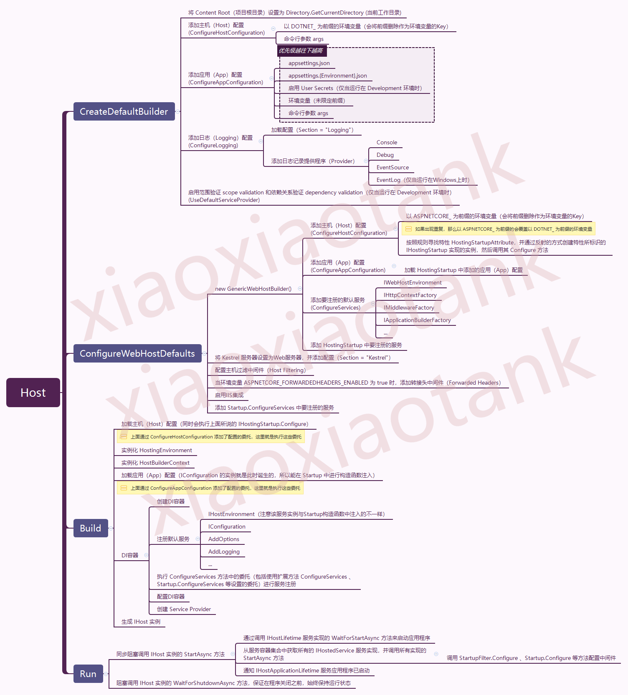

Demystifying `Host`
==============================

An **Host** is an object (check `internal sealed class Host`) that encapsulates an app's resources, such as:

* Dependency injection
* Logging
* Configuration
* IHostedService (background services, check `TimedHostedService` in CLR via C# Chapter 28)


Source Code:

```C#
public class Program {
   public static void Main(string[] args) {
      CreateHostBuilder(args).Build().Run();
   }

   public static IHostBuilder CreateHostBuilder(string[] args) => {
      Host.CreateDefaultBuilder(args)
          .ConfigureWebHostDefaults(webBuilder => {  
              webBuilder.UseStartup<Startup>();
          });
   });
}
```



```C#
public static class GenericHostBuilderExtensions
{
   public static IHostBuilder ConfigureWebHostDefaults(this IHostBuilder builder, Action<IWebHostBuilder> configure)
   {
      return builder.ConfigureWebHostDefaults(configure, _ => { });   
   }

   public static IHostBuilder ConfigureWebHostDefaults(this IHostBuilder builder, Action<IWebHostBuilder> configure, Action<WebHostBuilderOptions> configureOptions)
   {
      return builder.ConfigureWebHost(webHostBuilder =>  
      {
         WebHost.ConfigureWebDefaults(webHostBuilder);   
 
         // configure is webBuilder => webBuilder.UseStartup<Startup>();
         configure(webHostBuilder);    
      }, configureOptions);
   }
}

public static class WebHost
{
   // ...
   internal static void ConfigureWebDefaults(IWebHostBuilder builder) 
   {
      builder.ConfigureAppConfiguration((ctx, cb) =>
      {
         if (ctx.HostingEnvironment.IsDevelopment())
         {
            StaticWebAssetsLoader.UseStaticWebAssets(ctx.HostingEnvironment, ctx.Configuration);
         }
      });
      builder.UseKestrel((builderContext, options) =>
      {
         options.Configure(builderContext.Configuration.GetSection("Kestrel"), reloadOnChange: true);
      })
      .ConfigureServices((hostingContext, services) =>
      {
         // Fallback
         services.PostConfigure<HostFilteringOptions>(options =>
         {
            if (options.AllowedHosts == null || options.AllowedHosts.Count == 0)
            {
               // "AllowedHosts": "localhost;127.0.0.1;[::1]"
               var hosts = hostingContext.Configuration["AllowedHosts"]?.Split(new[] { ';' }, StringSplitOptions.RemoveEmptyEntries);
               // Fall back to "*" to disable.
               options.AllowedHosts = (hosts?.Length > 0 ? hosts : new[] { "*" });
            }
         });
         // Change notification
         services.AddSingleton<IOptionsChangeTokenSource<HostFilteringOptions>>(new ConfigurationChangeTokenSource<HostFilteringOptions>(hostingContext.Configuration));
         services.AddTransient<IStartupFilter, HostFilteringStartupFilter>();
         services.AddTransient<IStartupFilter, ForwardedHeadersStartupFilter>();
         services.AddTransient<IConfigureOptions<ForwardedHeadersOptions>, ForwardedHeadersOptionsSetup>();

         services.AddRouting(); // <-----------------
        })
        .UseIIS()
        .UseIISIntegration();
    }
}

public interface IStartup
{
   IServiceProvider ConfigureServices(IServiceCollection services);
   void Configure(IApplicationBuilder app);
}

public static class GenericHostWebHostBuilderExtensions
{
   public static IHostBuilder ConfigureWebHost(this IHostBuilder builder, Action<IWebHostBuilder> configure, Action<WebHostBuilderOptions> configureWebHostBuilder)
   {
      // ...
      var webhostBuilder = new GenericWebHostBuilder(builder, webHostBuilderOptions);    
      configure(webhostBuilder);        
      builder.ConfigureServices((context, services) => services.AddHostedService<GenericWebHostService>());  // <---------------
      return builder;
   }
}

internal sealed class GenericWebHostBuilder : IWebHostBuilder, ISupportsStartup, ISupportsUseDefaultServiceProvider
{
   private readonly IHostBuilder _builder;
   private readonly IConfiguration _config;
   // ...

   public IWebHostBuilder ConfigureServices(Action<IServiceCollection> configureServices)
   {
      return ConfigureServices((context, services) => configureServices(services));
   }

   public IWebHostBuilder ConfigureServices(Action<WebHostBuilderContext, IServiceCollection> configureServices)
   {
      // call IHostBuilder.ConfigureServices()
      _builder.ConfigureServices((context, builder) =>  // builder is IServiceCollection
      {
         var webhostBuilderContext = GetWebHostBuilderContext(context);
         configureServices(webhostBuilderContext, builder);
      });
 
      return this;
    }

    // this method is important
    private void UseStartup([DynamicallyAccessedMembers(StartupLinkerOptions.Accessibility)] Type startupType, HostBuilderContext context, IServiceCollection services)
    {
       // ...
       instance ??= ActivatorUtilities.CreateInstance(new HostServiceProvider(webHostBuilderContext), startupType);

       // Startup.ConfigureServices
       var configureServicesBuilder = StartupLoader.FindConfigureServicesDelegate(startupType, context.HostingEnvironment.EnvironmentName);
       var configureServices = configureServicesBuilder.Build(instance);
 
       configureServices(services);   // <------------------------- call your Startup.cs's ConfigureServices to register your own services
    }
}

internal sealed partial class GenericWebHostService : IHostedService
{
   // via ctor DI
   public GenericWebHostServiceOptions Options { get; }
   public IServer Server { get; }
   public ILogger Logger { get; }
   public ILogger LifetimeLogger { get; }
   public DiagnosticListener DiagnosticListener { get; }
   public ActivitySource ActivitySource { get; }
   public DistributedContextPropagator Propagator { get; }
   public IHttpContextFactory HttpContextFactory { get; }
   public IApplicationBuilderFactory ApplicationBuilderFactory { get; }
   public IEnumerable<IStartupFilter> StartupFilters { get; }
   public IConfiguration Configuration { get; }
   public IWebHostEnvironment HostingEnvironment { get; }
   //

   public async Task StartAsync(CancellationToken cancellationToken)
   {
      // ...
      RequestDelegate application = null;

      //  builder is IApplicationBuilder
      var builder = ApplicationBuilderFactory.CreateBuilder(Server.Features);

      // build the request pipeline
      application = builder.Build();  

      var httpApplication = new HostingApplication(application, Logger, DiagnosticListener, ActivitySource, Propagator, HttpContextFactory);
 
      await Server.StartAsync(httpApplication, cancellationToken);

      // ...
   }

   public async Task StopAsync(CancellationToken cancellationToken)
   {
      await Server.StopAsync(cancellationToken);
   }
}

public class ApplicationBuilderFactory : IApplicationBuilderFactory
{
   private readonly IServiceProvider _serviceProvider;

   public ApplicationBuilderFactory(IServiceProvider serviceProvider)
   {
      _serviceProvider = serviceProvider;
   }

   public IApplicationBuilder CreateBuilder(IFeatureCollection serverFeatures)
   {
      return new ApplicationBuilder(_serviceProvider, serverFeatures);
   }
}

public interface IServer : IDisposable
{
   IFeatureCollection Features { get; }

   Task StartAsync<TContext>(IHttpApplication<TContext> application, CancellationToken cancellationToken) where TContext : notnull;

   Task StopAsync(CancellationToken cancellationToken);
}

internal sealed class KestrelServerImpl : IServer
{
   // ...
}
```

When you register your own service in "Startup.cs", "Startup.cs"'s ConfigureServices method must somehow "connect" to the `HostBuilder` in "Program.cs"

So how does "Startup.cs"'s `ConfigureServices` method influence `HostBuilder`s `_configureServicesActions` so that the services you register in "Startup.cs" can be actually add to the Host in "Program.cs"? It is the `ConfigureWebHostDefaults` method acts as the bridge.

## `Host` Source Code

```C#
public static class HostingAbstractionsHostExtensions
{
   public static void Run(this IHost host)        // when that method exits, the application exits
   {
      host.RunAsync().GetAwaiter().GetResult();   // blocks until the method exits
   }
   
   public static async Task RunAsync(this IHost host, CancellationToken token = default)
   {
      try 
      {
         await host.StartAsync(token).ConfigureAwait(false);             // finish quickly
         await host.WaitForShutdownAsync(token).ConfigureAwait(false);   // the most of time, program stuck here
      }
      finally
      {
         // ...
         host.Dispose();
      }
   }

   public static async Task WaitForShutdownAsync(this IHost host, CancellationToken token = default)
   {
      // this is NOT ConsoleLifetime, 
      IHostApplicationLifetime applicationLifetime = host.Services.GetRequiredService<IHostApplicationLifetime>(); 

      var waitForStop = new TaskCompletionSource<object>(TaskCreationOptions.RunContinuationsAsynchronously);

      applicationLifetime.ApplicationStopping.Register(obj => 
      {
         var tcs = (TaskCompletionSource<object>)obj;
         tcs.TrySetResult(null);
      }, waitForStop);

      await waitForStop.Task;  // await the Task, this will block until ApplicationStopping is triggered
      await host.StopAsync();
   }
}

public partial class ConsoleLifetime : IHostLifetime, IDisposable
{
   private CancellationTokenRegistration _applicationStartedRegistration;
   private CancellationTokenRegistration _applicationStoppingRegistration;

   private IHostApplicationLifetime ApplicationLifetime { get; }   // via DI in ctor

   // ... ctor

   public Task WaitForStartAsync(CancellationToken cancellationToken)
   {
      // ...
      AppDomain.CurrentDomain.ProcessExit += OnProcessExit;   // attach event handlers for SIGTERM and Ctrl+C
      Console.CancelKeyPress += OnCancelKeyPress;

      return Task.CompletedTask;
   }

   public Task StopAsync(CancellationToken cancellationToken)
   {
      // there's nothing to do here
      return Task.CompletedTask;
   }

   private void OnProcessExit(object sender, EventArgs e)
   {
      ApplicationLifetime.StopApplication();  // <-----------------
      // ...
      System.Environment.ExitCode = 0;
   }

   private void OnCancelKeyPress(object sender, ConsoleCancelEventArgs e)
   {
      e.Cancel = true;
      ApplicationLifetime.StopApplication();  // <-----------------
   }
}

//--------------------V
public interface IHost : IDisposable
{
   IServiceProvider Services { get; }
   Task StartAsync(CancellationToken cancellationToken = default);
   Task StopAsync(CancellationToken cancellationToken = default);
}

internal sealed class Host : IHost, IAsyncDisposable  // namespace Microsoft.Extensions.Hosting.Internal
{
   private readonly ILogger<Host> _logger;
   private readonly IHostLifetime _hostLifetime;     //  ConsoleLifetime by default
   private readonly ApplicationLifetime _applicationLifetime;
   private readonly HostOptions _options;
   private readonly IHostEnvironment _hostEnvironment;
   private readonly PhysicalFileProvider _defaultProvider;
   private IEnumerable<IHostedService>? _hostedServices;  // <--------------- contains GenericWebHostService which runs Kestrel in the background
   private volatile bool _stopCalled;

   public Host(IServiceProvider services, IHostEnvironment hostEnvironment, PhysicalFileProvider defaultProvider, IHostApplicationLifetime applicationLifetime,
               ILogger<Host> logger, IHostLifetime hostLifetime, IOptions<HostOptions> options);
   
   public IServiceProvider Services { get; }

   public async Task StartAsync(CancellationToken cancellationToken = default)
   {
      _logger.Starting();
      using var combinedCancellationTokenSource = CancellationTokenSource.CreateLinkedTokenSource(cancellationToken, _applicationLifetime.ApplicationStopping);
      CancellationToken combinedCancellationToken = combinedCancellationTokenSource.Token;

      // return very quick, it just register event listener for SIGTERM and Ctrl+C 
      await _hostLifetime.WaitForStartAsync(combinedCancellationToken).ConfigureAwait(false);

      combinedCancellationToken.ThrowIfCancellationRequested();
      _hostedServices = Services.GetRequiredService<IEnumerable<IHostedService>>();   // that's how you can call AddHostedService to register your own IHostedService

      foreach (IHostedService hostedService in _hostedServices)  // start each background services (GenericWebHostService/Kestrel is the first one to start )
      {
         // fire IHostedService.Start
         await hostedService.StartAsync(combinedCancellationToken).ConfigureAwait(false);

         if (hostedService is BackgroundService backgroundService)
         {
            _ = TryExecuteBackgroundServiceAsync(backgroundService);
         }
      }

      // fire IHostApplicationLifetime.Started
      _applicationLifetime.NotifyStarted();

      _logger.Started();
   }

   private async Task TryExecuteBackgroundServiceAsync(BackgroundService backgroundService) 
   {
      // backgroundService.ExecuteTask may not be set (e.g. if the derived class doesn't call base.StartAsync)
      Task? backgroundTask = backgroundService.ExecuteTask;
      if (backgroundTask == null)
         return;

      try
      {
         await backgroundTask.ConfigureAwait(false);
      }
      catch (Exception ex)
      {
         // when the host is being stopped, it cancels the background services. This isn't an error condition, so don't log it as an error
         if (_stopCalled && backgroundTask.IsCanceled && ex is OperationCanceledException)
            return;

         _logger.BackgroundServiceFaulted(ex);
         if (_options.BackgroundServiceExceptionBehavior == BackgroundServiceExceptionBehavior.StopHost)
         {
            _logger.BackgroundServiceStoppingHost(ex);
            _applicationLifetime.StopApplication();
         }
      }
   }

   public async Task StopAsync(CancellationToken cancellationToken = default)
   {
      _stopCalled = true;
      _logger.Stopping();

      using (var cts = new CancellationTokenSource(_options.ShutdownTimeout))
      using (var linkedCts = CancellationTokenSource.CreateLinkedTokenSource(cts.Token, cancellationToken))
      {
         CancellationToken token = linkedCts.Token;
         _applicationLifetime.StopApplication();

         IList<Exception> exceptions = new List<Exception>();
         if (_hostedServices != null)  // started?
         {
            foreach (IHostedService hostedService in _hostedServices.Reverse())
            {
               try
               {
                  await hostedService.StopAsync(token).ConfigureAwait(false);
               }
               catch (Exception ex)
               {
                  exceptions.Add(ex);
               }
            }
         }

         _applicationLifetime.NotifyStopped();

         try
         {
            await _hostLifetime.StopAsync(token).ConfigureAwait(false);
         }
         catch (Exception ex)
         {
            exceptions.Add(ex);
         }
 
         if (exceptions.Count > 0)
         {
            var ex = new AggregateException("One or more hosted services failed to stop.", exceptions);
            _logger.StoppedWithException(ex);
            throw ex;
         }
      }
      _logger.Stopped();
   }

   // ...
}
//--------------------Ʌ


//-----------------------------V
public interface IHostedService   // provides a nice way to properly start background tasks in web applications, check the TimedHostedService Example in CLR via C# Chapter28
{
   Task StartAsync(CancellationToken cancellationToken);
   Task StopAsync(CancellationToken cancellationToken);
}

public abstract class BackgroundService : IHostedService, IDisposable   // let you write less code for implementing background tasks
{
   private Task _executeTask;
   private CancellationTokenSource? _stoppingCts;

   public virtual Task? ExecuteTask => _executeTask;

   protected abstract Task ExecuteAsync(CancellationToken stoppingToken);

   public virtual Task StartAsync(CancellationToken cancellationToken)
   {
      _stoppingCts = CancellationTokenSource.CreateLinkedTokenSource(cancellationToken);

      _executeTask = ExecuteAsync(_stoppingCts.Token);

      // if the task is completed then return it, this will bubble cancellation and failure to the caller
      if (_executeTask.IsCompleted)
      {
         return _executeTask;
      }

      // otherwise it's running
      return Task.CompletedTask;
   }

   public virtual async Task StopAsync(CancellationToken cancellationToken)
   {
      if (_executeTask == null)
         return;

      try
      {
         _stoppingCts!.Cancel();
      }
      finally
      {
         // wait until the task completes or the stop token triggers
         await Task.WhenAny(_executeTask, Task.Delay(Timeout.Infinite, cancellationToken)).ConfigureAwait(false);
      }
   }
}
//------------------------------Ʌ
```

```C#
//----------------------V
public static class Host {  // provides convenience methods for creating instances of Microsoft.Extensions.Hosting.IHostBuilder with pre-configured defaults

   public static IHostBuilder CreateDefaultBuilder() => CreateDefaultBuilder(args: null);

   public static IHostBuilder CreateDefaultBuilder(string[] args) {   // initializes a new instance of HostBuilder class with pre-configured defaults
      var builder = new HostBuilder();

      builder.UseContentRoot(Directory.GetCurrentDirectory());   // specify the content root directory to be used by the host.

      builder.ConfigureHostConfiguration(config => {             // config is IConfigurationBuilder
         config.AddEnvironmentVariables(prefix: "DOTNET_");
         if (args != null) {
            config.AddCommandLine(args);
         }
      });
      // ------------------Configures application settings, the is the main topic of this chapter----------------------------------------------
      builder.ConfigureAppConfiguration((hostingContext, config) => {   // hostingContext is HostBuilderContext, config is IConfigurationBuilder
          IHostEnvironment env = hostingContext.HostingEnvironment;
          bool reloadOnChange = hostingContext.Configuration.GetValue("hostBuilder:reloadConfigOnChange", defaultValue: true);

          config.AddJsonFile("appsettings.json", optional: true, reloadOnChange: reloadOnChange)   // You can see that appsettings.json will always be used
                .AddJsonFile($"appsettings.{env.EnvironmentName}.json", optional: true, reloadOnChange: reloadOnChange);

          if (env.IsDevelopment() && !string.IsNullOrEmpty(env.ApplicationName)) {
             var appAssembly = Assembly.Load(new AssemblyName(env.ApplicationName));
             if (appAssembly != null) {
                config.AddUserSecrets(appAssembly, optional: true);   // asp.net core app uses secerets by default
             }
          }

          config.AddEnvironmentVariables();

          if (args != null) {
             config.AddCommandLine(args);
          }
      });
      // ----------------------------------------------------------------------------------------------------------------------------------------
      builder.ConfigureLogging((hostingContext, logging) => {
         logging.AddConfiguration(hostingContext.Configuration.GetSection("Logging"));
         logging.AddConsole();
         logging.AddDebug();
      });

      // Configures the DI container
      builder.UseDefaultServiceProvider((context, options) => {
         var isDevelopment = context.HostingEnvironment.IsDevelopment();
         options.ValidateScopes = isDevelopment;
         options.ValidateOnBuild = isDevelopment;
      });

      return builder;
   }
}
//----------------------Ʌ

//---------------------------V
public interface IHostBuilder {
   IDictionary<object, object> Properties { get; }

   IHostBuilder ConfigureAppConfiguration(Action<HostBuilderContext, IConfigurationBuilder> configureDelegate);
   IHostBuilder ConfigureContainer<TContainerBuilder>(Action<HostBuilderContext, TContainerBuilder> configureDelegate);
   IHostBuilder ConfigureHostConfiguration(Action<IConfigurationBuilder> configureDelegate);
   IHostBuilder ConfigureServices(Action<HostBuilderContext, IServiceCollection> configureDelegate);
   IHostBuilder UseServiceProviderFactory<TContainerBuilder>(IServiceProviderFactory<TContainerBuilder> factory);
   IHostBuilder UseServiceProviderFactory<TContainerBuilder>(Func<HostBuilderContext, IServiceProviderFactory<TContainerBuilder>> factory);

   IHost Build();
}

public static class HostingHostBuilderExtensions {
   ...
   public static IHostBuilder UseContentRoot(this IHostBuilder hostBuilder, string contentRoot) {
      return hostBuilder.ConfigureHostConfiguration(configBuilder => {
         configBuilder.AddInMemoryCollection(new[] {
            new KeyValuePair<string, string>(HostDefaults.ContentRootKey,
            contentRoot  ?? throw new ArgumentNullException(nameof(contentRoot)))
         });
      });
   }
   
   // specify the IServiceProvider to be the default one
   public static IHostBuilder UseDefaultServiceProvider(this IHostBuilder hostBuilder, Action<HostBuilderContext, ServiceProviderOptions> configure) {
      return hostBuilder.UseServiceProviderFactory(context => {
         var options = new ServiceProviderOptions();
         configure(context, options);
         return new DefaultServiceProviderFactory(options);
      });
   }

   public static IHostBuilder ConfigureLogging(this IHostBuilder hostBuilder, Action<ILoggingBuilder> configureLogging) {
      return hostBuilder.ConfigureServices((context, collection) => collection.AddLogging(builder => configureLogging(builder)));
   }
}

public class HostBuilder : IHostBuilder 
{
   private List<Action<IConfigurationBuilder>> _configureHostConfigActions = new List<Action<IConfigurationBuilder>>();
   private List<Action<HostBuilderContext, IConfigurationBuilder>> _configureAppConfigActions = new List<Action<HostBuilderContext, IConfigurationBuilder>>();
   private List<Action<HostBuilderContext, IServiceCollection>> _configureServicesActions = new List<Action<HostBuilderContext, IServiceCollection>>();
   private List<IConfigureContainerAdapter> _configureContainerActions = new List<IConfigureContainerAdapter>();
   private IServiceFactoryAdapter _serviceProviderFactory = new ServiceFactoryAdapter<IServiceCollection>(new DefaultServiceProviderFactory());
   private bool _hostBuilt;
   private IConfiguration _hostConfiguration;  // this is the starting point for _appConfiguration, check C9
   private IConfiguration _appConfiguration;   // will hold all the configuration key values eventually
   private HostBuilderContext _hostBuilderContext;
   private IHostingEnvironment _hostingEnvironment;
   private IServiceProvider _appServices;

   public IDictionary<object, object> Properties { get; } = new Dictionary<object, object>();

   public IHostBuilder ConfigureHostConfiguration(Action<IConfigurationBuilder> configureDelegate) {
      _configureHostConfigActions.Add(configureDelegate ?? throw new ArgumentNullException(nameof(configureDelegate)));
      return this;
   }

   public IHostBuilder ConfigureAppConfiguration(Action<HostBuilderContext, IConfigurationBuilder> configureDelegate) {
      _configureAppConfigActions.Add(configureDelegate ?? throw new ArgumentNullException(nameof(configureDelegate)));
      return this;
   }

   public IHostBuilder ConfigureServices(Action<HostBuilderContext, IServiceCollection> configureDelegate) {
      _configureServicesActions.Add(configureDelegate ?? throw new ArgumentNullException(nameof(configureDelegate)));
      return this;
   }

   // overrides the factory used to create the service provider
   public IHostBuilder UseServiceProviderFactory<TContainerBuilder>(IServiceProviderFactory<TContainerBuilder> factory) {
       _serviceProviderFactory = new ServiceFactoryAdapter<TContainerBuilder>(factory ?? throw new ArgumentNullException(nameof(factory)));
       return this;
   }
   ...
   public IHost Build() {
      if (_hostBuilt) {
         throw new InvalidOperationException("Build can only be called once.");
      }
      _hostBuilt = true;

      BuildHostConfiguration();     // add environment related providers to ConfigurationBuilder
      CreateHostingEnvironment();   // provide HostingEnvironment that tells the app the environment e.g "Development"
      CreateHostBuilderContext();   // provide HostBuilderContext for BuildAppConfiguration as the first paramater to execute the delegate
      BuildAppConfiguration();
      CreateServiceProvider();

      return _appServices.GetRequiredService<IHost>();
   }

   private void BuildHostConfiguration() {
      var configBuilder = new ConfigurationBuilder();
      foreach (var buildAction in _configureHostConfigActions) {
         buildAction(configBuilder);
      }
      _hostConfiguration = configBuilder.Build();
   }

   private void CreateHostingEnvironment() {
      _hostingEnvironment = new HostingEnvironment() {
         ApplicationName = _hostConfiguration[HostDefaults.ApplicationKey],
         EnvironmentName = _hostConfiguration[HostDefaults.EnvironmentKey] ?? EnvironmentName.Production,
         ContentRootPath = ResolveContentRootPath(_hostConfiguration[HostDefaults.ContentRootKey], AppContext.BaseDirectory),
      }
      _hostingEnvironment.ContentRootFileProvider = new PhysicalFileProvider(_hostingEnvironment.ContentRootPath);
   }

   private void CreateHostBuilderContext() {
      _hostBuilderContext = new HostBuilderContext(Properties) {
         HostingEnvironment = _hostingEnvironment,
         Configuration = _hostConfiguration
      }
   }

   private void BuildAppConfiguration() {
      var configBuilder = new ConfigurationBuilder();
      configBuilder.AddConfiguration(_hostConfiguration);  //  <--------------- C9,  _hostConfiguration is combined with _appConfiguration
      foreach (var buildAction in _configureAppConfigActions) {
         buildAction(_hostBuilderContext, configBuilder);
      }
      _appConfiguration = configBuilder.Build();   // _appConfiguration is ConfigurationRoot, and note that IConfigurationRoot : IConfiguration
      _hostBuilderContext.Configuration = _appConfiguration;
   }

   private void CreateServiceProvider() {
      var services = new ServiceCollection();   // <------------------------------
      services.AddSingleton(_hostingEnvironment);
      services.AddSingleton(_hostBuilderContext);
      services.AddSingleton(_appConfiguration); // register ConfigurationRoot as IConfiguration
                                                // _appConfiguration is ConfigurationRoot but declared as IConfiguration
      services.AddSingleton<IApplicationLifetime, ApplicationLifetime>();
      services.AddSingleton<IHostLifetime, ConsoleLifetime>();
      
      // there is nothing special about the Host, what we reaaly want is to use registered  _appConfiguration etc, that's why HostBuilder's Build doesn't return a constructed Host
      services.AddSingleton<IHost, Host>(); 
      services.AddOptions();                   
      services.AddLogging();

      foreach (var configureServicesAction in _configureServicesActions) {
         configureServicesAction(_hostBuilderContext, services);
      }

      var containerBuilder = _serviceProviderFactory.CreateBuilder(services);   // containerBuilder is IServiceProvider

      foreach (var containerAction in _configureContainerActions) {
         containerAction.ConfigureContainer(_hostBuilderContext, containerBuilder);
      }

      _appServices = _serviceProviderFactory.CreateServiceProvider(containerBuilder);   // it registers IServiceProvider internally (in ServiceProviderEngine)
                                                                                        // this is why we can inject IServiceProvider (root scope) into our services
   }
   ...
}
//---------------------------Ʌ

public class DefaultServiceProviderFactory : IServiceProviderFactory<IServiceCollection> {
   private readonly ServiceProviderOptions _options;

   public DefaultServiceProviderFactory() : this(ServiceProviderOptions.Default) { }
   ...

   public IServiceCollection CreateBuilder(IServiceCollection services) {
      return services;
   }

   public IServiceProvider CreateServiceProvider(IServiceCollection containerBuilder) {
      return containerBuilder.BuildServiceProvider(_options);
   }
}

public class HostBuilderContext {
   public HostBuilderContext(IDictionary<object, object> properties);
   public IConfiguration Configuration { get; set; }
   public IHostEnvironment HostingEnvironment { get; set; }
   public IDictionary<object, object> Properties { get; }
}
```


<!-- <code>&lt;T&gt;<code> -->

<!-- <div class="alert alert-info p-1" role="alert">
    
</div> -->

<!-- <div class="alert alert-info pt-2 pb-0" role="alert">
    <ul class="pl-1">
      <li></li>
      <li></li>
    </ul>  
</div> -->

<!-- <ul>
  <li></li>
  <li></li>
  <li></li>
  <li></li>
</ul>  -->

<!-- <ul>
  <li><b></b></li>
  <li><b></b></li>
  <li><b></b></li>
  <li><b></b></li>
</ul>  -->

<!--  -->

<!-- <span style="color:red">hurt</span> -->

<style type="text/css">
.markdown-body {
  max-width: 1800px;
  margin-left: auto;
  margin-right: auto;
}
</style>

<link rel="stylesheet" href="./zCSS/bootstrap.min.css">
<script src="./zCSS/jquery-3.3.1.slim.min.js"></script>
<script src="./zCSS/popper.min.js"></script>
<script src="./zCSS/bootstrap.min.js"></script>